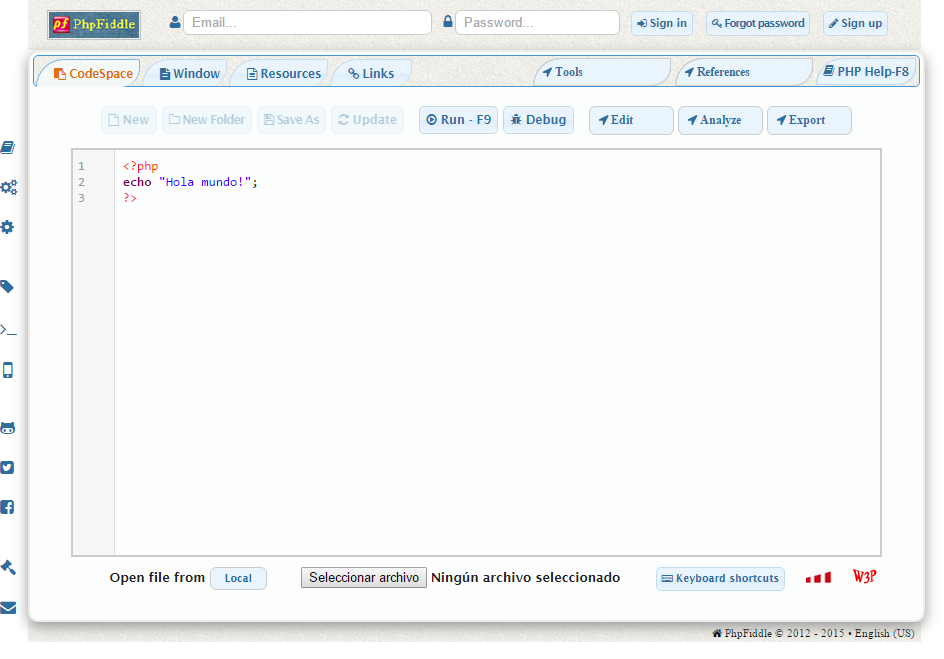

[<< Volver al listado completo](../){:class="solid-btn text-center"}

# Programación web con PHP

Vicente Herrera - [@vicen_herrera](https://twitter.com/vicen_herrera)

## Módulo 1: Introducción

### ¿Qué es PHP?

**PHP** es el acrónimo recursivo de "Php Hypertext Preprocesor". Su nombre constituye por tanto una especie de broma a la hora de establecer dentro del mismo significado de sus siglas de nuevo la expresión "PHP".

Creado en 1994 por **Ramus Lerdorf**, su primera versión eran una serie de ficheros binarios escritos en lenguaje C que se ejecutaban mediante CGI (Common Gateway Interface) para rastrear visitas. Inicialmente lo llamó Persona Home Page Tools, liberando su código fuente en 1995. Para conocer una historia más detallada, visita [http://php.net/manual/es/history.php.php](http://php.net/manual/es/history.php.php)

Se trata de un lenguaje de programación orientado a la web. Aunque puede ser interpretado desde linea de comandos, sus instrucciones se especifican entre las etiquetas de comienzo `<?php` y final `?>` en un archivo HTML. Esto indica a un servidor web que el código dentro de dichas etiquetas debe ser ejecutado e interpretado antes de enviar el resultado en HTML al navegador que lo solicitó.

Este es un lenguaje tipo "**script**", es decir, no requiere compilarse previamente, sino que cada instrucción es ejecutada mientras el programa intérprete recorre su código. Esto ocasiona que muchos errores de programación no sean detectados hasta que no intenta ejecutarse la linea erronea.

En la práctica, los intérpretes de PHP para acelerar la ejecución almacenan en una cache propia una versión compilada en bytecodes del código ejecutable, y existen diferentes mecanismos para validar la corrección del código antes de ejecutarse.

La sintaxis de php es en parte similar a la de C y C++, y por lo tanto algo parecida también a la de JavaScript, aunque con muy importantes diferencias.

En algunos aspectos PHP es un lenguaje despreciado frente a otros con paradigmas o frameworks más complejos, como Ruby on Rails, ASP.NET, Java junto a toda su infraestructura web, etc.

Pero no hay que despreciar que PHP hace funciona la mayor parte de las webs que existen en el mundo. En Septiembre de 2015, PHP era utilizado en el 81,3% de las webs mundiales, seguido por ASP.NET y Java con unos merjos 16,5 y 3,0% respectivamente. \
Referencia: [http://w3techs.com/technologies/overview/programming_language/all](http://w3techs.com/technologies/overview/programming_language/all)

> Grandes proyectos han sido hechos éxitos internacionales con PHP, como Facebook (que recientemente inventó su propia versión modificara de PHP llamada [Hack](http://hacklang.org/). PHP es además el lenguaje de programación con el que funciona WordPress, el cual en Septiembre de por si solo posibilita la existencia de más del 58% de las webs con CMS conocidos, y más de un 24% de la totalidad de las webs existentes en internet.  \
Referencia: [http://w3techs.com/technologies/details/cm-wordpress/all/all](http://w3techs.com/technologies/details/cm-wordpress/all/all)_

### Arquitectura web dinámicas

Como hemos dicho, PHP se puede ejecutar por un servidor cuando se solicita una página web, pero también puede ser interpretado desde una linea de comandos invocando el intérprete PHP.

Es el primer escenario es el más complejo, y para entenderlo bien, tenemos que tener bien clara cómo funciona la tecnología que rodea la web.

_Diagrama de arquitectura cliente/servidor web_

Por un lado tenemos los clientes, que son los navegadores de los usuarios, que solicitan visualizar una web, y por otra los servidores, que son los ordenadores que reciben esas solicitudes y envian el resultado a los clientes.

Todo comienza con la solicitud de una página dirección web. A nivel más sencillo, esta dirección podría consistir en un fichero **.html** que sería enviado al navegador cliente. Pero en nuestro caso más general, la dirección apuntará a un fichero **.php**.

Este fichero puede contener algunas instrucciones HTML, pero sobre todo contendrá código PHP que debe ser ejecutado y sustituido por su resultado antes de enviarlo al cliente.

El código PHP puede llamar a otros ficheros .PHP, consultar bases de datos MySQL, y poner en marcha toda una compleja arquitectura para construir el resultado que debe ser enviado al navegador.

Al final, toda esta ejecución se traduce en un resultado enviado al navegador consistente en un documento HTML que este interpreta.

En la interpretación que el navegador hace del documento HTML ya recibido, puede haber llamadas a otros ficheros CSS de estilos o JavaScript de código a ejecutar en el cliente, que son servidos de nuevo por el servidor web.

Pero también es posible que el código JavaScript haga llamadas una vez el documento ya se ha cargado a direcciones URL (técnica llamda Ajax) cuyo resultado sea también procesado desde el servidor por PHP.

No hay que olvidar que entre cada llamada, el sistema parte de un estado “tabula rasa”, donde no hay persistencia entre lo que ha ocurrido entre la llamada actual y cualquiera de las anteriores. El programa PHP necesita que se le indique, mediante diferentes técnicas, qué debe procesar, y en qué estado se encuentra la información, para poder así construir la salida correcta.

Cómo lleva a cabo esto será una de las tareas que vamos a ir aprendiendo durante el curso.

### Versiones de PHP

La versión en producción más actual de PHP a la escritura de este manual es la v5.6.13, liberada el 3 de Septiembre de 2015.

A su vez, las versiones v5.5 y v5.4 reciben actualizaciones de seguridad, pero no las v5.3 y anteriores.

Esto es importante ya que algunos hospedajes no permiten actualizar así como así la versión de PHP que ejecutan, y aunque en el pasado este lenguaje se ha llevado mucho tiempo sin cambios, en la actualidad el avance es bastante significativo. Además de mejoras de rendimiento y seguridad, podemos encontrar en las últimas versiones nuevas construcciones del lenguaje, que si nuestro hospedaje no soporta, nos impedirá ejecutar el código que las esté utilizando.

Por ejemplo, [la última versión estable de WordPress, recomienda el uso de PHP 5.6](https://wordpress.org/about/requirements/). Según se advierte en su página, es capaz de ejecutarse en PHP 5.2.4+, aunque no está recomendado por poder quedar el sitio web expuesto a vulnerabilidades de seguridad.

Como estamos al principio del curso, sería dificil entender los cambios a nivel de lenguaje que introduce cada versión. Pero dado que para practicar tendremos o bien que procurarnos un hospedaje, o bien instalar un servidor Apache con PHP en nuestro ordenador, es importante que conozcamos que no todas las versiones de PHP son iguales. La recomendación en este caso es emplear PHP 5.6 en su última versión, ya que lo que aprendamos con ésta será lo más actual.

Puedes comprobar con detalle las diferencias entre cada versión de PHP en el siguiente enlace: \
[http://php.net/manual/es/migration56.php](http://php.net/manual/es/migration56.php)

Existe una versión de desarrollo de PHP v7. En este caso, se ha omitido directamente la v6, ya que durante cierto tiempo estuvo en desarrollo una versión con esa numeración, pero presentó tantos problemas, que el equipo de desarrollo la abandonó para lanzar directamente la que se estaba preparando como PHP 7. \
[http://php.net/manual/es/migration70.php](http://php.net/manual/es/migration70.php)

### Editor de código

Los ficheros PHP son ficheros de texto plano, que pueden ser modificados con cualquier editor de código que queramos emplera. Aquellos más avanzados nos ofreceran coloreado de código resltando con diferentes colores cada tipo de elemento, y autocompletado de funciones PHP, con sugerencias y ayuda sobre las mismas.

Para este curso utilizaremos Sublime Text, ya que se encuentra presente en Windows, Mac o Linux; pero cualquier otro que quiera utilizar el alumno es igualmente válido. Este editor puede descargarse de la dirección: [http://www.sublimetext.com](http://www.sublimetext.com)

Sublime Text puede utilizarse de forma gratuita, pero cada cierto tiempo nos recuerda que nos registremos pagando por la versión completa.

Si el alumno quiere por su cuenta conocer más detalles de este editor, puede profundizar visitando los siguientes enlaces:

### PHPFiddle

Para algunas pruebas utilizaremos un servicio online llamado PHPFiddle, que nos permite compartir y ejecutar pequeños trozos de código PHP.

Esto permitirá compartir entre nosotros referencias rápidas, así como ponernos a funcionar inmediatamente aunque no todos tengamos instalados un entorno de desarrollo PHP.

Puedes intentar ejecutar cualquier ejemplo en su web en: [http://phpfiddle.org/](http://phpfiddle.org/)

### Tipos de instalación

El entorno de ejecución de PHP puede ser instalado de diferentes formas, y cuando montemos nuestros entorno de desarrollo debemos entender las diferencias de cada uno, sus ventajas e inconvenientes:

* **CGI** (Common Gateway Interface): Básicamente el servidor web tomara la entrada, se la entregará a un ejecutable del intérprete PHP, y enviará la salida al cliente. Es la forma más básica de configurar PHP en un servidor web, y la de peor rendimiento
* **ISAPI** (Internet Server Application Programming Interface): Disponible solo en el servidor IIS (Internet Information Services) de Microsoft para Windows. En este caso, el servidor web en lugar de lanzar un proceso ejecutable PHP, ataca directamente un punto de entrada de una librería DLL. El problema es que al compartir el proceso del servidor con PHP, esto puede causar problemas de estabilidad con funciones PHP que no son “thread safe”.
* **FastCGI**: Como mejora de CGI, esta solución nos ofrece al mismo tiempo buen rendimiento y estabilidad. En lugar de lanzar un nuevo proceso PHP por cada llamada, existe una colección de procesos a la espera de procesar las peticiones, de forma que no tengan que ser creados y destruidos en cada ejecución.

### Stack XAMPP

Para instalar nuestro propio servidor web en nuestro ordenador, utilizaremos XAMPP, el ofrecido por Apachefriends.org en: [https://www.apachefriends.org/es/index.html](https://www.apachefriends.org/es/index.html)  

Este entorno está disponible gratuitamente para Windows, Linux y Mac, y al instalarlo contaremos directamente con:

* Servidor web Apache
* Lenguaje PHP en el servidor Web
* Lenguaje Perl en el servidor Wep
* Motor de base de datos MySQL
* Servidor FTP Filezilla
* Servidor Tomcat de aplicaciones Java
* Servidor de correo Mercury Mail
* Cliente PHP de MySQL phpMyAdmin
* Estadísticas de servidor Webalizer
* Fake Sendmail para compatibilidad Windows con envío emails desde PHP

Al instalarlo bajo Windows, es probable que se nos hagan dos recomendaciones:

* Desactivar el antivirus temporalmente durante la instalación, para que ésta funcione más rápido
* No instalarlo en la carpeta c:\Program Files(x86)\ ya que el sistema de control de cuentas de usuario de Windows puede traer conflictos.

### Hosting

Un hospedaje o “hosting” donde subir nuestro código PHP es una buena opción también para aprender; aunque durante el curso nos basaremos en montar nuestras pruebas en PHPFiddle o en un servidor local XAMPP.

El hospedaje nos permitiría subir nuestras páginas a una dirección en internet, y al contrario que en las pruebas solo en local, cualquiera podrá visitar la dirección de la página creada y comprobar el resultado. A cambio, será más engorroso modificar rápidamente los ficheros y detectar los errores. Lo habitual es contar siempre con un entorno de desarrollo en local como XAMPP, para luego subir los ficheros resultado al hospedaje online.

A la hora de contar con un servicio de Hosting (hospedaje), es fundamental tener en cuenta estos parámetros:

* El precio, obviamente
* Qué tamaño de almacenaje de ficheros nos permite subir
* Qué lenguajes ejecuta (querremos que ejecute PHP)
* Qué versión de PHP nos ofrece, cuanto más alta mejor
* Si ofrece bases de datos MySQL, cuántas y de cuánto tamaño máximo
* Si nos ofrece cuentas de email, cuántas y de qué capacidad

Otros parámetro como la memoria disponible para PHP, o la velocidad de procesamiento del servidor suelen ser difíciles de averiguar.

Aunque hay muchas buenas alternativas disponibles, si quieres aprender en un hospedaje donde puedas hacer pruebas con buenas características, una recomendación es Hostinger: \
[http://www.hostinger.com](http://www.hostinger.com)

Una cuenta gratuita en este hospedaje te permite probar todas las opciones que tiene un hospedaje de pago, pero con la problemática de que si la web que montes recibe muchas visitas, se bloqueará de vez en cuando mostrando un error 500 a los visitantes. Pero para aprender, es un recurso muy útil.

---
[Siguiente >>](./2.md){:class="solid-btn text-center"}