[<< Volver al listado completo](../){:class="solid-btn text-center"}

# Desarrollo web con HTML, CSS y JavaScript

Vicente Herrera - [@vicen_herrera](https://twitter.com/vicen_herrera)

## Módulo 1.1: HTML5 Y CSS3

### Introducción a HTML

HTML son las siglas de “Hyper Text Media Language”, el lenguaje documental empleado para definir páginas web que pueden ser visualizadas por un navegador.

No es un lenguaje de programación, sino un lenguaje documental que define cómo visualizar un documento, en este caso una página web. Puede contener elementos de otros lenguajes, como CSS, o JavaScript (este último sí es un lenguaje de programación).

En cualquier ordenador, los ficheros de datos utilizados por los programas pueden estar en formato texto, que solo incluyen caracteres visibles, como los ficheros `.txt` que se editan con el bloc de notas de Windows; o en formato binario, que incluye codificación de caracteres no visibles, como los antiguos ficheros `.doc` o `.xls` de Office. Esta última práctica, que favorecía mantener en la oscuridad en método utilizado para representar la información, está casi en desuso, utilizando en su lugar ficheros de texto con lenguajes visualmente interpretables por una persona, quizás antes comprimidos en formato zip para que ocupen menos tamaño (como por ejemplo los ficheros `.docx` y `.xlsx` de las últimas versiones de Office).

En nuestro caso utilizaremos el lenguaje HTML en ficheros de texto, que pueden ser abiertos por programas sencillos como el bloc de notas, aunque también utilizaremos programas más complejos que nos ayuden a trabajar mejor.

Por lo tanto, si creamos un fichero ejemplo.html, y escribimos en él algo como esto:

```html
<h1>Prueba fichero HTML</h1>Hola mundo!
```

Si arrastramos y soltamos el fichero creado sobre un navegador, veremos como resultado que la primera frase aparece en mayor tamaño como una cabecera, y la segunda aparece de menor tamaño en una segunda línea. ¡Enhorabuena, has creado tu primer fichero HTML!

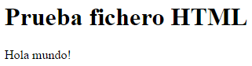

Puede que no esté siendo tan fácil como parece… ¿Qué problemas nos podemos encontrar en este primer intento?

1. Si creamos el fichero con el bloc de notas de Windows, éste le añade al final la extensión .txt por defecto. Si no tenemos activado visualizar las extensiones de fichero, aunque le intentemos cambiar a mano la extensión, estaremos manteniendo la antigua extensión .txt
2. Si hacemos doble click sobre el fichero, puede que el programa asociado a esa extensión sea el bloc de notas, u otro editor instalado en el ordenador. Arrastrar y soltar el fichero sobre el navegador abierto nos asegurará que lo que ocurra sea que se visualice en el navegador.

Resueltos estos posibles problemas, podemos intentar facilitarnos el trabajo utilizando un editor dedicado para HTML (aunque tan solo con el bloc de notas es posible hacer alguna cosa sencilla). A continuación os recomiendo varios editores gratuitos, aunque también existen otras alternativas comerciales más complejas:

* **Visual Studio Code**: [https://code.visualstudio.com/](https://code.visualstudio.com/){:target=_blank}
  * Para Windows, MacOs o Linux, totalmente libre.
* **Sublime Text**: [http://www.sublimetext.com/](http://www.sublimetext.com/){:target=_blank}
  * Para Windows, MacOS o Linux, la versión gratuita puede mostrar mensajes ocasionales pidiéndonos que nos registremos.
* **Notepad++**: [https://notepad-plus-plus.org/](https://notepad-plus-plus.org/){:target=_blank}
  * Gratuito, solo para Windows, casi todo el mundo lo tiene instalado como alternativa puntual, aunque no lo utilicemos todos los días.
* **Notepad2-mod**: [https://xhmikosr.github.io/notepad2-mod/](https://xhmikosr.github.io/notepad2-mod/){:target=_blank}
  * Una alternativa muy ligera al Bloc de notas de Windows, poco conocida, pero bastante utilizada en mi caso, preferible para mí incluso a Notepad++ (aunque no incorpora pestañas)
* **gEdit**: [http://projects.gnome.org/gedit/](http://projects.gnome.org/gedit/){:target=_blank}
  * Los usuarios de Linux lo traerán ya instalado si utilizan el escritorio Gnome

Obviamente las alternativas comerciales son totalmente válidas, como Dreamweaver o Webstorm, pero en este curso queremos concentrarnos en los fundamentos del lenguaje, y no en las cualidades de una herramienta en concreto. 

Si tienes curiosidad sobre qué utilizo yo habitualmente… un pequeño IDE llamado PhpDesigner, pero más que por sus virtudes para la edición en HTML, por su inteligente funcionalidad de sugerencia de código en PHP. Y si te interesa el uso de Vim o Emacs… buena suerte, amigo, te hará falta.

En principio, si es preciso concretar un IDE para este curso, haremos referencia a Sublime Text.

Ya tenemos en nuestras manos una herramienta para editar ficheros de texto en nuestro ordenador, y una manera de comprobar el resultado en el navegador. Pero… ¿qué relación tiene esto con las páginas web alojadas en Internet?

Estos mismos archivos que vamos a crear pueden ser colocados en un servidor web, y permitir mostrar una página accediendo a la dirección de internet de dicho servidor. Estos archivos obviamente siempre mostrarían el mismo resultado al acceder a la página, haciendo necesario cambiar a mano el contenido del archivo para mostrar cambios en las páginas.

En los inicios de Internet, esto se hacía así… y se sigue haciendo cuando queremos poner en marcha una página con una información que no cambia nunca, y que va a ser visitada por muchísimos usuarios, por lo que se debe mostrar lo más rápido y con el mínimo de recursos consumidos en el servidor. Pero en la mayoría de sitios web, en realidad el contenido no se almacena en un fichero estático, sino que un programa en un lenguaje de programación (por ejemplo, PHP, Java o C#), crean sobre la marcha el contenido HTML y lo envían al navegador como si se tratara de un fichero que ya existía. Estos programas, a su vez, para almacenar los diferentes datos sobre contenidos, usuarios y estado de las sesiones, utilizan un motor de base de datos, como MySQL, Oracle o SQL Server. Y conforme entramos en más detalles, aparecen más tecnologías y la cosa se complica.

Pero en el fondo, el contenido siempre es HTML. En la mayoría de los casos, los contenidos se almacenan en ficheros de plantilla, donde está escrito en HTML cómo se van a visualizar algunos elementos, y luego se sustituyen unas marcas específicas por el contenido dinámico.

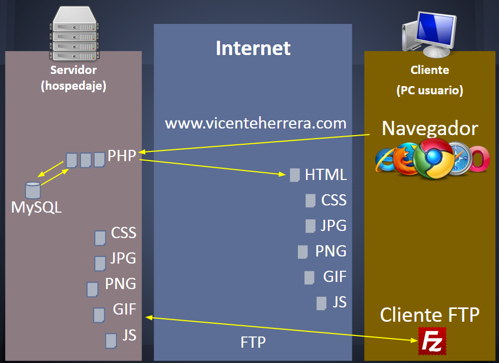

En definitiva lo que nos interesa saber es que todo el conocimiento que vamos a adquirir creando ficheros HTML estáticos es de utilidad inmediata para proyectos más complejos.

Por último, es preciso que hablemos un poco sobre versiones de HTML y compatibilidad. Seguramente no será desconocido al lector la histórica lucha en el pasado entre navegadores (Microsoft Internet Explorer y Netscape Navigator) por controlar el estándar HTML. En la actualidad afortunadamente la última versión de HTML, la 5, constituye un estándar que es aceptado en casi todo su contenido por todos los navegadores. Aunque cada navegador puede ofrecer funcionalidad particular adicional, HTML5 de base nos ofrece todo lo que podemos querer utilizar. Por ello, en este curso trabajaremos siempre sobre HTML5 sin hacer demasiada distinción sobre qué es nuevo y qué no (ya que se trata de un curso completo y no solo vamos a tratar las novedades). Pero no podemos olvidar que siempre cabe alguna funcionalidad de HTML5 funcione de manera diferente en distintos navegadores, cosa que mencionaremos e incluiremos referencias para estudiar estos casos en mayor detalle.

Existen por tanto multitud de tecnologías asociadas al desarrollo web, pero en todas ellas el HTML es un elemento indispensable.

**Algunas de las tecnologías involucradas con la web**

<table>
  <tr>
   <td><em>Servidor de base de datos</em>
   </td>
   <td><em>Lenguajes de servidor web</em>
   </td>
   <td><em>Servidor web</em>
   </td>
   <td><em>Navegador web, estáticos</em>
   </td>
   <td><em>Navegador web, dinámicos</em>
   </td>
  </tr>
  <tr>
   <td><strong>MySQL</strong>
   </td>
   <td><strong>PHP</strong>
   </td>
   <td><strong>Apache</strong>
   </td>
   <td><strong>HTML</strong>
   </td>
   <td><strong>JavaScript, jQuery, ...</strong>
   </td>
  </tr>
  <tr>
   <td>MariaDb
   </td>
   <td>Python
   </td>
   <td>(ficheros html en disco)
   </td>
   <td><strong>IMG</strong>
   </td>
   <td><strong>GIFs animados</strong>
   </td>
  </tr>
  <tr>
   <td>Oracle
   </td>
   <td>Perl, Java
   </td>
   <td>nginx, lighttp, ...
   </td>
   <td><strong>CSS</strong>
   </td>
   <td><strong>CSS3</strong>
   </td>
  </tr>
  <tr>
   <td>SQL Server
   </td>
   <td>ASP.NET, C#
   </td>
   <td>IIS
   </td>
   <td><strong>JPG, PNG, GIF</strong>
   </td>
   <td><strong>Flash</strong>
   </td>
  </tr>
  <tr>
   <td>MongoDb, PostGre, ...
   </td>
   <td>Ruby
   </td>
   <td>Rails
   </td>
   <td>
   </td>
   <td><strong>Java, Activex,...</strong>
   </td>
  </tr>
</table>

### Uso de etiquetas

Comencemos a crear ya un documento HTML. Todo documento en HTML5, incluso aunque esté totalmente en blanco, debería contener al menos el siguiente contenido.

```html
<!DOCTYPE html>
<html>
	<head>
		<title></title>
	</head>
	<body>
	</body>
</html>
```

Los espacios en blanco antes de cada línea pueden conseguirse introduciendo espacios individuales, pero es más práctico utilizar la tecla tabulador para introducir de golpe la separación necesaria. En estos ejemplos verás las letras coloreadas como lo haría un editor HTML como los mencionados antes, aunque en realidad estos caracteres no tienen ningún color asociado, es solo algo que el editor hace para facilitar la lectura del documento.

¿Qué quieren decir todos estos caracteres? Identificamos que tenemos ciertos elementos encerrados entre símbolos `<` y `>`, que son llamados **etiquetas**. ciertas etiquetas tienen la misma palabra, pero precedida por el símbolo `/`. Se trata en realidad de **cierre de etiquetas**, y consideramos que entre la apertura de etiqueta (la primera vez que aparece) y el cierre, todo lo que está en medio es el **contenido de la etiqueta**. Vemos por tanto que una etiqueta puede contener a su vez varias etiquetas.

El significado exacto de estas etiquetas es el siguiente:

* `<!DOCTYPE html>`: Esta es una etiqueta especial que indica que la versión de HTML es la 5. Tiene esta estructura ya que procede de la sintaxis de XML, un lenguaje más genérico que HTML que permite definir sublenguajes como el que estamos estudiando.
* `<html>`: Inicio de todo el documento HTML
* `<head>`: Inicio de la **cabecera** del documento, donde especificaremos metainformación del mismo, que no forma parte del contenido visualizable directamente en la ventana principal del navegador.
* `<title>`: El texto en su contenido es el **título** de la página, que será mostrado en la pestaña o título de la ventana del navegador, entre otras cosas.
* `<body>`: El contenido de esta etiqueta será lo que se muestre dentro del navegador

En realidad, el ejemplo anterior como hemos dicho no muestra nada. Un ejemplo equivalente al primero que realizamos en el apartado anterior, sería el siguiente.

```html
<!DOCTYPE html>
<html>
	<head>
		<meta charset="utf8">
		<title>Título de la página</title>
	</head>
	<body>
		<h1>Prueba fichero HTML</h1>Hola mundo!
	</body>
</html>
```

En este caso, además de añadir el contenido de prueba de la página, tenemos algunos elementos más:

* `<meta charset="utf8">`: Indica al navegador que el contenido de la página está codificado en formato UTF-8. Debe ser lo primero que aparezca en la etiqueta `<head>`.

¿Por qué es necesario incluir esta etiqueta? Resulta que aunque el texto plano solo contenga caracteres visualizables, existen diferentes estándares para representar caracteres extendidos (aquellos no existentes en el lenguaje inglés), como acentos o eñes, o símbolos en japonés, chino, ruso, etc. Para asegurarnos que nuestra página utiliza bien estos caracteres, y que el navegador los puede representar correctamente, puede ser necesario incluir esta etiqueta.

También deberemos asegurarnos que el editor de texto guarda el documento con codificación UTF-8. Bajo Windows, la mayoría de los programas trabajan con la codificación ANSI, que no es la más óptima por diversos motivos de compatibilidad.

Para asegurarnos que guardamos el documento con codificación desde Sublime Text, elegiremos El bloc de notas de Windows no lo hace (utiliza ANSI), por lo que para esta ocasión referenciamos a Sublime Text, elegiremos la opción de menú **File**, **Save with encoding**, **UTF-8 with BOM**. En notepad2-mod, la opción está en **File**, **Encoding**, **UTF-8**. En Notepad++ está en **Encoding**, **Encode in UTF-8**. En el Bloc de notas (si, también puede cambiarse aquí), está en **Archivo**, **Guardar cómo**, y en diálogo para elegir la carpeta de destino, hay una opción **Codificación** que habrá que establecer como **UTF-8**.

Al cambiar la codificación, y volver a visualizar el documento en el navegador, no notaremos un gran cambio ya que no habíamos utilizado acentos en el contenido. Pero en el título de pestaña del navegador ahora deberían verse correctamente los acentos utilizados.

Si quieres profundizar en el conocimiento sobre las codificaciones de caracteres y UTF-8, un buen punto de partida es este enlace en español de la W3C (World Wide Web Consortium), el organismo encargado de la estandarización de la web:

[http://www.w3.org/International/questions/qa-what-is-encoding.es.php](http://www.w3.org/International/questions/qa-what-is-encoding.es.php)

Otros enlaces útiles:

[https://es.wikipedia.org/wiki/Codificaci%C3%B3n_de_caracteres](https://es.wikipedia.org/wiki/Codificaci%C3%B3n_de_caracteres)

[https://es.wikipedia.org/wiki/UTF-8](https://es.wikipedia.org/wiki/UTF-8)

Aunque el ejemplo anterior es un documento HTML completo correcto, por brevedad en muchos ejemplos incluimos tan solo el contenido que debe aparecer dentro de la etiqueta `<body>` del documento.

Habrás observado que en el ejemplo anterior, hay espacios o tabuladores introducidos que no se han mostrado en el resultado final, así como un salto de línea entre la cabecera y la línea siguiente que no hemos introducido en el texto original. Esto ocurre así porque en HTML se ignoran los espacios iniciales y los extras que separan una palabra de otra a partir del primero. Por tanto, estos dos ejemplos producen el mismo resultado.

```html
<h1>Prueba 
fichero HTML</h1>Hola       mundo!
```

```html
<h1>
	Prueba fichero HTML
</h1>
Hola 
mundo!
```

Esto nos permite utilizar los espacios, tabuladores y nuevas líneas para formatear el código del documento HTML de forma que sea más legible, y quede de manifiesto la anidación de etiquetas, sin que afecte al resultado final. ¿Pero cómo conseguiremos entonces añadir dichos espacios y nuevas líneas cuando lo necesitemos? Lo veremos en el siguiente apartado.

### Etiquetas HTML5

Ahora que podemos crear un documento HTML básico, nos interesa conocer qué etiquetas tenemos a nuestra disposición y cómo utilizarlas. 

* `<h1>`: Elemento de cabecera de primer nivel
* `<h2>`: Elemento de cabecera de segundo nivel
* `<a>`: Enlace
* ``: Imagen
* `<p>`: Párrafo
* `<br>`: Nueva línea

Los elementos h1, h2, h3, y sucesivos, indican textos de cabecera de primer, segundo, tercer y sucesivos niveles. Además de convertir representar el texto con cierto tamaño, incluyen el introducir un nuevo párrafo con cualquier contenido incluido antes y después de estos elementos.

El elemento “a” es muy importante, nos sirve para crear enlaces en nuestro documento. Podemos ver cómo se utiliza utilizando un ejemplo donde incluiremos algunos conceptos adicionales.

```html
<a href="http://www.w3c.es" 
     id="enlace-w3c" 
     class="enlaces-principales" 
     target="_blank" 
     title="Enlace a web del W3C" 
     >Visita w3c.es</a>
```

Aquí vemos que la etiqueta `<a>`, antes del símbolo `>` que marca su cierre, incluye una serie de elementos llamados **atributos**, seguidos de un signo igual y una serie de **valores** entre comillas. De nuevo, los espacios y retorno de líneas adicionales nos sirven para dar un formato más inteligible al ejemplo, y hubiera sido equivalente haberlo escrito de la siguiente manera.

```html
<a href="http://www.w3c.es" id="enlace-w3c" class="enlaces-principales" target="_blank" title="Enlace a web del W3C">Visita w3c.es</a>
```

Los atributos de este ejemplo tienen el siguiente significado:

* `href`: Específico de etiquetas `<a>`, representa el destino del enlace, que será cargado por el navegador al pulsar sobre éste. Puede ser a su vez de varios tipos
    * Enlace http interno a otro punto de la página actual
    * Enlace http relativo o absoluto a otra página del mismo dominio
    * Enlace http absoluto a otra página en otro dominio
    * Enlace a otro protocolo, por ejemplo `mailto` para envío de email
* `id`: Identificador único del elemento, para su manipulación en cuanto a estilo con CSS, o de comportamiento mediante JavaScript. No se puede repetir en el documento actual
* `class`: Nombre de la clase del elemento, para su manipulación en cuanto a estilo con CSS, o de comportamiento mediante JavaScript. Puede repetirse en el documento actual, y un mismo elemento puede tener más de una clase (separadas por espacio al definirlas aquí).
* `target`: Específico de etiquetas `<a>` y formularios, en este caso especifica dónde se debe abrir el enlace al pulsarlo:
    * _blank: Una nueva pestaña o documento
* `title`: Define el título del enlace. Por ejemplo, en enlaces que pueden tener como texto “leer más”, define el título completo del artículo de destino.

Tenemos entonces que la etiqueta `<a>` representa un enlace en el documento, que al pulsarlo llevará a lo especificado en el atributo `href`. Todo el contenido desde la apertura de `<a>` hasta el cierre de `</a>` podrá ser pulsado para llevarnos al nuevo destino.

Estos no son todos los atributos posibles de esta etiqueta. Si quieres consultar la extensa lista de posibles atributos, tienes a tu disposición la referencia oficial de la W3C (World Wide Web Consortium) en:

[http://www.w3.org/TR/html5/](http://www.w3.org/TR/html5/)

Una referencia más light, aunque a veces imprecisa o incluso errónea (procede con cautela), es la que puedes encontrar en la siguiente web (no afiliada con la W3C, a pesar de su nombre):

[http://www.w3schools.com/html/default.asp](http://www.w3schools.com/html/default.asp)

Como hemos comprobado, necesitamos alguna herramienta para introducir párrafos o retornos de línea, y lo conseguiremos con las etiquetas `<p>` y `<br>`.

```html
<p>Ejemplo de un párrafo con contenido. Este texto se ha añadido para hacer que sea lo suficientemente largo como para observar el efecto cuando no cabe en pantalla completo en una sola línea</p>
<p>Este es otro párrafo. Este texto se ha añadido para hacer que sea lo suficientemente largo como para observar el efecto cuando no cabe en pantalla completo en una sola línea<br>
Esto debería esta en otra línea, pero en el mismo párrafo</p>
```

Si nos fijamos, la etiqueta `<br>` no tiene cierre, ya que al representar una nueva línea, no tiene ningún contenido en su interior. Esto también podemos representarlo escribiéndola como:  \
`<br />`

Aunque la forma `<br>` está aceptada como válida en HTML5.

Otra etiqueta importante es ``, que nos permitirá añadir imágenes al documento. Si colocamos una imagen de nombre _prueba.jpg_ en el directorio que nuestro documento HTML, podemos escribir un ejemplo como éste para utilizarla.

```html

```
En este caso la etiqueta `` tampoco tiene contenido que incorporar, por lo que en lugar de cerrarla con `</img>`, escribimos el final de la etiqueta de apertura como `/>` para indicar que se cierra automáticamente. De nuevo, en HTML5 es opcional utilizar este cierre.

En esta etiqueta, hemos definido dos nuevos atributos:

* `src`: Define la ruta absoluta o relativa a una imagen que esté en un formato como JPEG, GIF, o PNG.
* `alt`: Texto alternativo que describe a la imagen. Es de especial importancia para la accesibilidad (dispositivos que permiten navegar a personas con problemas de visión), así como para la optimización para buscadores.

Por último, existen unas etiquetas que permiten hacer listas de elementos, con posibilidad de otras listas anidadas en su interior. Un ejemplo puede ser el siguiente:

```html
<ul>
	<li>Inicio</li>
	<li>Quienes somos</li>
	<li>Productos
		<ul>
			<li>Diseño web</li>
			<li>Identidad corporativa</li>
			<li>Cartelería</li>
		</ul>
	</li>	
	<li>Contacto</li>
</ul>
```

En este caso, las etiquetas que estamos utilizando son:

* `ul`: Lista no ordenada (cada elemento es precedido por un círculo sólido, no un número).
* `li`: Elemento de lista. Puede contener otras listas a su vez.

Este ejemplo presentaría el siguiente aspecto en el navegador:

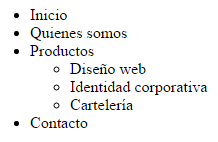

Existen muchísimas etiquetas más, y un conocimiento profundo de todas ellas requeriría un curso completo. Pero con esto hemos visto suficientes casos como para poder avanzar en otros contenidos, así como para poder buscar referencias puntuales cuando necesitemos otras etiquetas.


### La Web Semántica: HTML5

Las etiquetas estructurales descritas anteriormente proporcionan una visualización específica de su contenido, aunque ésta puede variar ligeramente para cada navegador.

HTML5 introduce además etiquetas semánticas, que no aportar de base ningún comportamiento visual adicional, pero que nos permiten por un lado definir de forma semántica el significado de su contenido, lo que será muy útil para el SEO (la optimización de contenidos para buscadores). Posteriormente podremos aportar estilos adicionales a estas etiquetas mediante CSS. Las etiquetas más utilizadas son:

Estructura de cuerpo del documento

* `<header>`: Grupo de elementos de introducción de un documento (como los h1, h2). No confundir con `<head>`, la cabecera HTML que contiene metainformación no visible.
*  `<nav>`: Enlaces de navegación. Podría contener un menú de navegación horizontal, o lateral.
* `<section>`: Define una sección en un documento. Por ejemplo, la sección central con el conjunto de artículos de un blog, o podríamos tener una sección por cada categoría de artículos, con un listado de artículos dentro.
* `<aside>`: Contenidos vagamente relacionados con el resto del contenido de la página. Si no es visualizado, el contenido restante seguirá teniendo sentido. Por ejemplo, anuncios, u otros contenidos.
* `<footer>`: Pie de una página o sección.

Dentro del cuerpo

* `<article>`: Contenido con identidad propia, que podría existir aportando información de manera independiente del resto del documento.

Otros elementos:

* `<cite>`: Título de una publicación
* `<address>`: Dirección física
* `<time>`: Fecha y hora

Como referencia para profundizar en este tema, además de las mencionadas añadimos la web de Mozilla Developer Network, que es bastante clara y concisa:

[https://developer.mozilla.org/es/docs/HTML/HTML5/HTML5_lista_elementos](https://developer.mozilla.org/es/docs/HTML/HTML5/HTML5_lista_elementos)

Siempre que queramos añadir un bloque con contenido a nuestra página, es útil comprobar si tiene un significado semántico de entre los incluidos en las etiquetas HTML5. En caso de no coincidir con ninguno, siempre podemos utilizar el bloque de contenido neutro `<div>` o el de texto de línea neutro `<span>`, que estilaremos igualmente por CSS.

Un ejemplo de estructura de página utilizando etiquetas semánticas HTML5 sería el siguiente

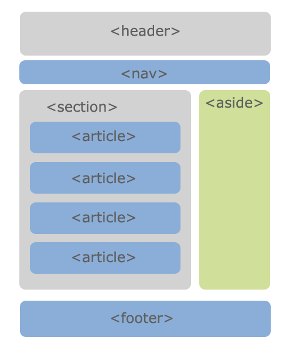

_By Neformal.lviv (Own work) [Public domain], via Wikimedia Commons_

Y un ejemplo construido con código quedaría en completo algo así:

```html
<!DOCTYPE html>
<html>
	<head>
		<meta charset="utf8">
		<title>Ejemplos curso HTML, CSS y JS</title>
	</head>
	<body>
		<header>
			<h1>Ejemplos del curso sobre HTML, CSS y JavaScript</h1>
			<nav>
				<ul>
					<li><a href="index.html">Inicio</a></li>
					<li>Ejemplos HTML
						<ul>
							<li><a href="1-base.html"
								>Documento base (en 
								blanco)</a></li>
							<li><a href="2-primer.html"
								>Primer ejemplo</a></li>
							<li><a href="3-lista.html"
								>Lista</a></li>
							<li><a href="4-semanticas.html"
								>Etiquetas semánticas 
								HTML5</a></li>
						</ul>
					</li>
				</ul>
			</nav>
		</header>
		<section>
			<article><h1>Documento base (en blanco)</h1></article>
			<article><h1>Primer ejemplo</h1></article>
			<article><h1>Lista</h1></article>
			<article><h1>Etiquetas semánticas HTML5</h1></article>
		</section>
		<footer>Fichero de ejemplo "Etiquetas semánticas HTML5" del curso sobre HTML, CSS y JavaScript
		</footer>
	</body>
</html>
```

Este fichero puede servirnos para ir almacenando y enlazando los diferentes ejemplos. En este caso, tenemos la navegación como una lista de enlaces, en la que más adelante añadiremos otras categorías como CSS y JavaScript. Luego una sección donde tan solo incluimos como artículos los títulos de los ejemplos, pero podemos más adelante añadir a cada artículo una pequeña captura de pantalla del código de ejemplo con un enlace. Finalmente, un pie con alguna información general de la página.

El resultado visualmente en el navegador deja mucho que desear:

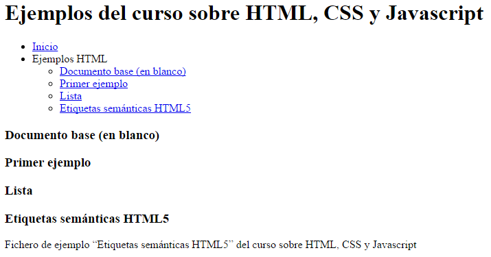

Pero precisamente el propósito de las etiquetas semánticas es no proporcionar ningún tipo de estilo adicional, solo marcar el significado de cada una de estas secciones para poder ser entendidas mejor por sistemas automáticos, como los buscadores.

### IDEs: Sublime Text

De entre las posibles opciones como editor de código, Sublime Text destaca por ser compatible con todos los sistemas operativos, poder utilizarse de forma gratuita (aunque con ventanas solicitando registrarse de vez en cuando), y ser muy ligero y rápido de cargar. Su sistema de plugins permite además incorporar funcionalidades adicionales.

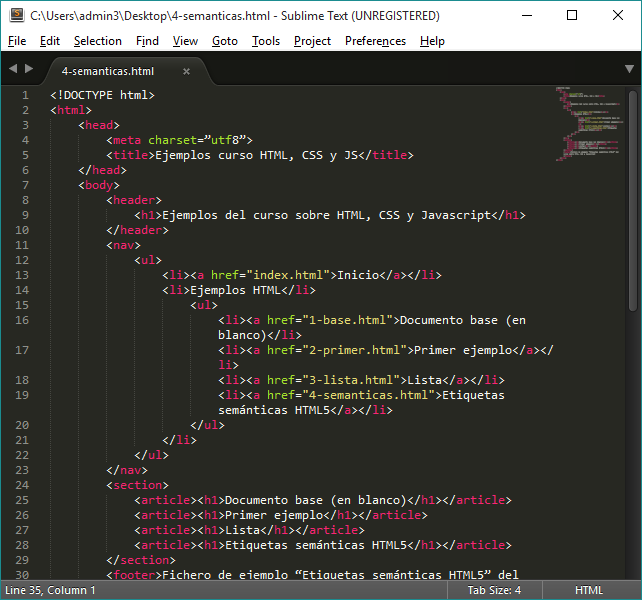

Este IDE (Integrated Development Enviroment, Ambiente de Desarrollo Integrado) tiene tantas opciones que aprenderlas todas de nuevo requeriría un curso completo. Vamos a referenciar aquí al menos una funcionalidad esencial que nos van a facilitar mucho el trabajo.

Con Sublime podemos crear “Proyectos”, al que añadamos una o varias carpetas, de forma que editemos los archivos de dichas carpetas con mayor comodidad.

Para ello, crearemos una carpeta en nuestro escritorio por ejemplo donde dejaremos los ficheros de ejemplo que hemos estado construyendo hasta ahora, “Ejemplos_curso”.

En sublime, elegiremos la opción de menú _Project_, _Save project as_, para guardar en un fichero la configuración del proyecto actual, por ejemplo “Proyecto_curso”.

Luego elegiremos en el menú _Project_, _Add folder to project_, y navegaremos hasta la carpeta “Ejemplos_curso” que hemos creado antes.

Con esto tendremos nuestro entorno en sublime con el siguiente aspecto:

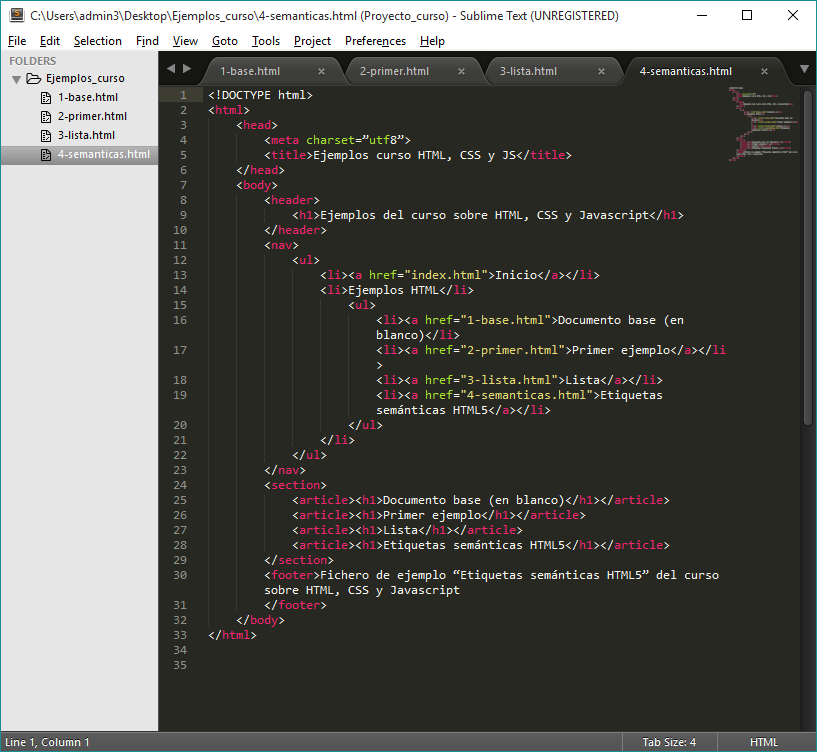

Conforme necesitemos añadir archivos o carpetas, podemos hacer click con el botón derecho sobre la carpeta “Ejemplos_curso” en la zona izquierda de Sublime, y añadirlos con facilidad.

Al cerrar Sublime y volverlo a abrir, comenzará con el último proyecto que teníamos definido.

Podemos cerrar el proyecto actual con _Project_, _Close Project_, y volverlo a abrir con _Project_, _Open Project_ o todavía más fácilmente con _Project_, _Open Recent_.

Existe una comunidad muy activa que crea plugins para Sublime y los ofrece como software libre. Para facilitar la búsqueda e instalación de estos, es útil utilizar en primer lugar el gestor de paquetes llamado directamente **Package Control**:

[https://packagecontrol.io/](https://packagecontrol.io/)

Entre los plugins que podemos utilizar, uno sencillo que facilitar trabajar con colores es **ColorHightlighter**:

[https://github.com/Monnoroch/ColorHighlighter](https://github.com/Monnoroch/ColorHighlighter)

Si quieres profundizar más en los atajos de teclado y diferentes usos que puedes darle a Sublime Text, existen innumerables guías por todo Internet. Puedes empezar por esta referencia:

[http://www.emezeta.com/articulos/guia-sublime-text](http://www.emezeta.com/articulos/guia-sublime-text)


### Inspector de código del navegador

Una herramienta de enorme utilidad a partir de este momento va a ser el inspector de código del navegador, que nos permite comprobar qué está interpretando este al abrir nuestro fichero, tanto a nivel de HTML como de CSS y JavaScript.

Por lo general, en los principales navegadores (Chrome, Firefox y Explorer/Edge) el inspector de código se despliega mediante la tecla F12.

El aspecto de cada inspector es ligeramente diferente, y no todos tienen las mismas funcionalidades. Con el de Internet Explorer o Edge podemos probar cómo se ve la página actual en versiones anterior con solo tener instalada la última versión.

Más información en: [https://dev.modern.ie/platform/documentation/f12-devtools-guide/](https://dev.modern.ie/platform/documentation/f12-devtools-guide/)

Firefox cuenta con una versión especial del navegador llamada “Firefox Developer”, con herramientas especializadas para desarrolladores. Además en Firefox podemos utilizar otra herramienta alternativa llamada Firebug.

Más info en: [https://www.mozilla.org/es-ES/firefox/developer/](https://www.mozilla.org/es-ES/firefox/developer/)

Chrome es uno de los navegadores que más ha propiciado desde el principio contar con un inspector de código avanzado desde el propio navegador sin necesidad de componentes adicionales, por lo que el suyo funciona de manera muy rápida en ordenadores con pocos recursos (aunque abrir muchas pestañas de Chrome agota estos rápidamente). Además podemos vincular los cambios de prueba que hagamos en memoria con los archivos físicos para utilizarlo como un editor de código.

Más info en: [https://developer.chrome.com/devtools](https://developer.chrome.com/devtools)

[https://developer.chrome.com/devtools/docs/workspaces](https://developer.chrome.com/devtools/docs/workspaces)

Por defecto lo que veremos al abrir cualquier inspector de código es una zona principal donde se muestra toda la estructura HTML de nuestro documento, y a la derecha los diferentes estilos CSS aplicados sobre el elemento seleccionado.

Si en algún momento cometemos un error en un documento, o queremos comprobar cómo está estructurado cierto código de ejemplo que no esté hecho por nosotros, será muy sencillo utilizando esta herramienta.

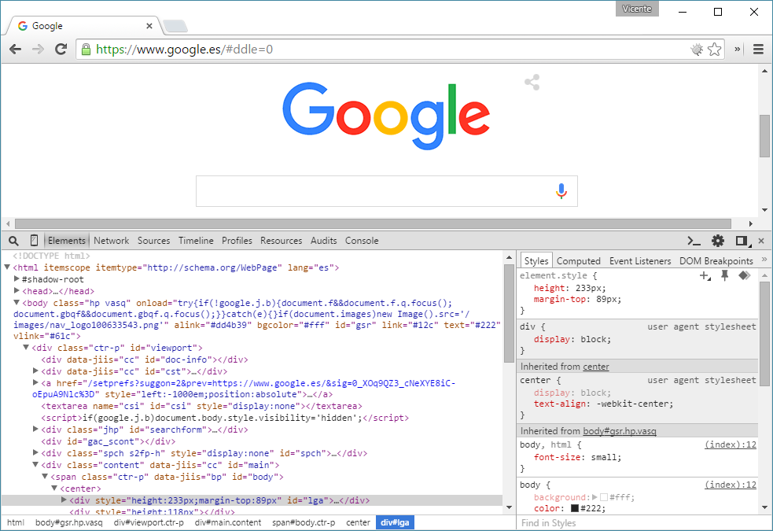


### Introducción a CSS

Ahora que somos capaces de construir la estructura del contenido de una web, vamos a aprender a aplicar estilos mediante CSS (Cascade Style Sheets, Hojas de Estilo en Cascada).

El código CSS es un lenguaje muy diferente de HTML, que podemos encontrar incorporado en ciertos trozos del documento HTML o enlazado mediante archivos externos que solo contienen código CSS.

Hay por tanto tres maneras de incorporar CSS en un documento HTML:

1. Estilo **inline**, incorporado en la propia etiqueta mediante el atributo `style`

```html
<a href="http://www.google.com" style="font-size:9px;">Enlace a Google</a>
```

  * El contenido del atributo se aplica directamente al elemento
  * No se recomienda utilizar esto, es mejor definir clases e identificadores, y utilizar hojas de estilos externas

2. Etiquetas `<style>` en `<head>`

```html
<html>
  <head>
    <style type="text/css">
      .cabecera {
        width: 980px;
        margin: 0 auto;
      }
    </style>
  </head>
  <body>
    <!-- ... -->
  </body>
</html>
```

* De esta manera incorporamos reglas CSS que se aplican a los elementos especificados en estas. Es preferible utilizar ficheros CSS externos

3. Enlace a archivo de estilos externo mediante etiqueta `<link>` en `<head>`


```html
<link href="special.css" rel="stylesheet" type="text/css" />
```

* El atributo `href` especificará la ubicación del fichero de estilos, y el atributo `rel` específica que se trata de una hoja de estilos. El atributo `type` con el valor text/css es opcional.

Pero, ¿cuál es el formato que tiene el código CSS que vamos a escribir? Se podría resumir de manera abstracta como una serie de **reglas**, en las que cada una de ellas especifica **sobre qué elementos se aplica** y qué **cambios visuales aplica sobre sus elementos**

```
(sobre qué se aplica la regla) {
  (cambio propiedad visual): valor;
  (cambio propiedad visual): valor;
  (cambio propiedad visual): valor;
  (cambio propiedad visual): valor;
}
```

### Selectores, propiedades más usadas

Los **selectores** son lo que definen **sobre qué elementos se aplican las reglas**

Pueden ser una combinación de:

* Nombre de etiquetas HTML
* Nombres de clases, precedidos por carácter `#`
* Identificador de elemento, precedido por carácter `.` (punto)

```css
a {
	color: orange;
}

.example_extract {
	background-color: #ccc;
}

#example_list {
	border: 1px solid #3e2f2d;
}
```

En el ejemplo anterior, podemos ver las siguientes reglas:

* Todas las etiquetas `<a>` serán de color naranja (orange).
* Todos los elementos de clase `example_extract` tendrán un color de fondo de código `#ccc` (gris).
* El elemento con el identificador `example_list` tendrá un borde sólido de 1 pixel de ancho, de color `#3e2f2d`.

```css
a.selected {
	color: blue;
}
```

En este ejemplo, la regla afectará a todas las etiquetas `<a>` que tengan especificadas la clase `selected`.

Otra opción es definir en el selector condiciones de anidamiento, por ejemplo, es decir, que la regla afecta a ciertos elementos dentro de otros elementos, separados por espacios. A su vez, esto se puede combinar con múltiples selectores, dando lugar a reglas como esta:

```css
#example_list a.button {
	background-color: blue;
	color: white;
	border-radius: 7px;
}
```

Esta regla indica que todos los elementos `<a>` que tengan especificada la clase `<button>`, y que estén dentro del elemento con identificador `example_list`, tendrán de color de fondo azul (blue), el color de texto será blanco (white) y los bordes serán redondeados con un radio de 7 píxeles.

Si tuviéramos a su vez esta regla junto a las anteriores, tendríamos dos sitios donde se define el color de ciertos enlaces. Cuando esto sucede, el orden de precedencia es:

* Son más prioritarias las reglas más específicas
* En igualdad de condiciones, se aplican en orden secuencial, siendo la última en aparecer la que finalmente se visualiza

Hemos visto también en estos ejemplos que existen propiedades múltiples, donde tras el nombre de la propiedad se especifican tras los dos puntos varios valores.

Si quisiéramos crear varias reglas que apliquen las mismas propiedades, pero a diferentes selectores, podemos hacerlo separando los selectores diferentes por comas, como en el siguiente ejemplo.

```css
section.projects h1, section.projects h2, section.projects h3 {
	color: #222;
}
```

Esta regla (o más correctamente, conjunción de reglas) establece que el color de texto de los elementos `<h1>`, `<h2>`, `<h3>` que se encuentren dentro de una etiqueta `<section>` con el atributo `class` con valor `projects`.

Otra característica que podemos utilizar en los selectores son las **pseudo clases** mediante el carácter `:`, que nos permiten seleccionar solo los elementos en un estado concreto, o las **especificaciones de valores de atributos**, que se incluyen entre corchetes `[` y `]`.

```css
a {
	text-decoration: none;
}

a:hover {
	text-decoration: underline;
}

input[type=button], input[type=submit], submit {
	font-size: 15px;
	font-family: sans-serif;
}
```

En este ejemplo hemos conseguido que las etiquetas `<a>` no vengan subrayadas por defecto. Pero cuando pasemos el ratón sobre ellas (la pseudo clase `hover`), si se aplicará la propiedad de subrayado.

También hemos hecho que las etiquetas `<input>` cuyo atributo `type` tenga el valor `button` o `submit`, así como la etiqueta `<submit>` (los tres casos son casi equivalentes), tengan siempre un texto de tamaño 15 píxeles, y un tipo de letra generico sans-serif (sin bordes en los extremos).

Una buena guía de todas las propiedades y pseudo clases disponibles en CSS es la disponible en Mozilla Developer Network:

[https://developer.mozilla.org/en-US/docs/Web/CSS/Reference](https://developer.mozilla.org/en-US/docs/Web/CSS/Reference)

No te sientas abrumado por la cantidad de propiedades, reglas, y combinaciones y trucos que se pueden llegar a hacer con CSS. En la práctica, solo el 20% de las propiedades se utilizan el 90% del tiempo, y casi siempre cuando necesitamos hacer algo poco habitual, podemos buscar ejemplos donde ya esté implementado y aprender de ellos.


### Modelo de caja, flujo del documento

Un aspecto importante de las propiedades de los elementos HTML que merece una explicación detallada es el llamado modelo de caja.

Cada elemento HTML ocupa un tamaño en la página web, que viene definido por:

* `margin`: el margen exterior del elemento
* `border`: el tamaño del borde del elemento
* `padding`: el margen interior del elemento

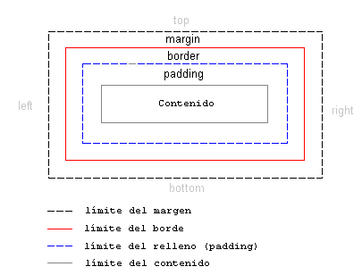

Por otro lado, tenemos que hablar de cómo se posicionan los elementos en la página. Hemos visto cómo algunos elementos, como `h1`, ocupan por defecto el 100% del ancho del contenedor donde se encuentren. Estos elementos tienen una propiedad CSS llamada `display` cuyo valor es de tipo `block`, y entre ellos tenemos:

* `h1`, `h2`, `h3`...
* Etiquetas semánticas como `header`, `nav`, `section`, `article`
* Etiqueta de bloque genérico `div`

Otros elementos de tipo `inline` como el texto se van acumulando en la misma línea, hasta llegar al final de esta y continuar en la línea siguiente. Se comportan de este modo:

* El texto
* Etiqueta de contenido inline generico span

Algunos elementos, como las imágenes, tienen un comportamiento de tipo `inline-block`, de manera que por defecto se muestran insertadas en medio del texto.

Estos valores por defecto pueden ser alterados, de manera que convirtamos un elemento que por defecto era de tipo `block` en `inline-block`. Al hacer esto, en lugar de ocupar el 100% del ancho del contenedor, pasará a ocupar el mínimo ancho posible para albergar su contenido, a menos que especifiquemos un ancho específico con la propiedad CSS `width`. También se comportará como las imágenes, de manera que aparecerá incluido en medio de la línea de texto donde se haya definido. Si a continuación del elemento teníamos algún texto, si no añadimos un retorno de línea o nuevo párrafo, aparecerá inmediatamente después del elemento.

Otra propiedad CSS que puede alterar el posicionamiento de los elementos es `float`, que al definirse con valores `right` o `left`, provocará que el elemento afectado omita totalmente su posición actual para alinearse lo más posible al lado indicado dentro de su misma línea, acumulando el resto de elementos al lado opuesto. Además, para elementos tipo `block`, pasarán a comportarse como `inline-block` respecto a su ancho, es decir, éste se ajustara o bien al definido explícitamente, o al mínimo según los elementos que contenga.

Si varios elementos consecutivos se definen con el mismo valor de `float`, estos empezarán a acumularse (separados por sus márgenes), hasta forzar una o varias nuevas líneas. En la práctica, es más deseable conseguir este efecto utilizando la propiedad `display` con valor `inline-block`, ya que existen ciertos fallos en los navegadores antiguos (Firefox en este caso) que hace que el comportamiento de elementos `float` no sea igual que en el resto de navegadores.

Por último, tenemos la propiedad `position`, que podemos definir con el valor `fixed` para que la posición del elemento se extraiga del flujo natural del documento, y pase a ser definido directamente en un tamaño en pixel relativo a los lados de la ventana del navegador mediante las propiedades `top`, `bottom`, `left` o `right`.

También podemos posicionar el elemento relativo a los bordes de otro elemento contenedor. Para ello, definiremos la propiedad CSS `position` como `relative` en el elemento contenedor, de manera que cualquier elemento interior tendrá la propiedad `position` como `absolute`.

¿Todo esto resulta confuso? Veámoslo mejor con un ejemplo completo. Sobre el mismo documento con la lista de ejemplos que preparamos para las etiquetas semánticas HTML5, vamos a añadir la siguiente hoja de estilos:

```css
/* Reglas generales */
* { font-family: sans-serif; }
body { margin: 0 }
a { text-decoration: none; }
a:hover { text-decoration: underline; }

/* Cabecera y navegación */
header {
    background-color: #DFD493;
    color: white;
    position: fixed;
    top: 0;
    width: 100%
}
header h1 {
    margin: 0; padding: 10px 10px;
    font-size: 25px;
}
nav {
    background-color: #EAE2B8;
    padding: 10px 10px;
    width: 100%
}
nav ul {
    list-style-type: none;
    display: inline-block;
    margin: 0; padding: 0;
}
nav ul li {
    display: inline-block;
    margin: 0 6px;
}

/* Secciones centrales */
section {
    width: 980px;
    margin: 30px auto;
    padding-top: 60px;
}
article {
    display: inline-block;
    background: #ccc;
    width: 240px; height: 240px;
    margin: 2px 2px;
    padding: 15px 15px;
}
article h1 {
    font-size: 15px;
}

/* Pie */
footer {
    background-color: #CBCD00;
    padding: 10px 10px;
    margin: 0;
}
```

Y el resultado es el siguiente:

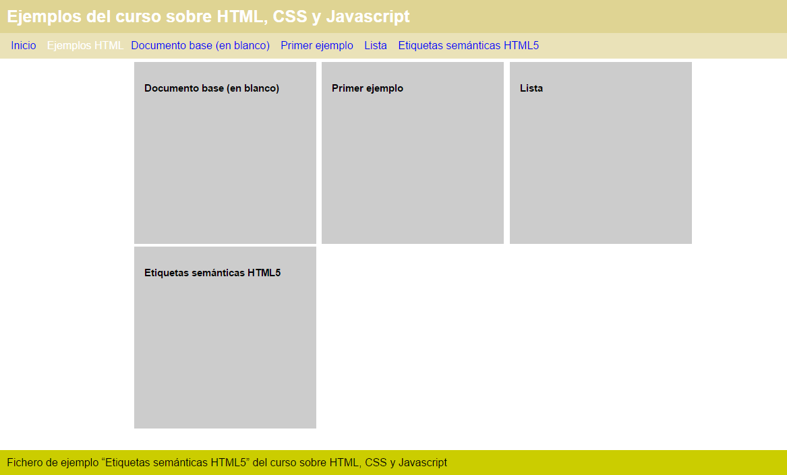

Un cambio bastante radical frente al mismo documento sin estilos. Vemos como un buen código HTML se la base adecuada para poco a poco tener un aspecto sofisticado a base de ir definiendo reglas CSS. 


### Reseteo de propiedades base de etiquetas

Hemos visto que muchas etiquetas, como `<h1>`, son dibujadas por el navegador con ciertos estilos predeterminados (tipo de letra, tamaño de letra, márgenes), aunque nosotros no los hayamos definido.

En algunos casos la implementación de esta renderización por defecto difiere en los diferentes navegadores, por lo que es necesario indicarla en nuestros propios ficheros, aunque incluso queramos utilizar los valores por defecto.

También es posible utilizar una hoja de estilos que resetee todos los estilos por defecto, de manera que durante el desarrollo nos aseguremos que el resultado visual es consistente en todos los navegadores sin tener que hacer constantes pruebas en cada uno. Unos ejemplos de este tipo de reglas de reseteo que podemos utilizar si queremos directamente en nuestros proyectos son los siguientes:

* [http://necolas.github.io/normalize.css/](http://necolas.github.io/normalize.css/)

* [http://html5doctor.com/html-5-reset-stylesheet/](http://html5doctor.com/html-5-reset-stylesheet/)


### Propiedades CSS3

Con la llegada de HTML5 también llega una nueva versión de CSS3 que, además de estandarizar mucho más el efecto de reglas ya conocidas, introduce algunas nuevas enormemente útiles para conseguir resultados muy efectistas de manera sencilla con muy poco código.

* `border-radius`: Hasta hace poco implementada como un idiom de cada navegador, especifica el radio para el que los bordes de un elemento será redondeado.
* `opacity`: Indica en tanto por uno el nivel de opacidad (o transparencia) del elemento. 
* `transition-duration`: Cuando definamos con una pseudo clase como `hover` alguna propiedad diferente, la transición al pasar el ratón sobre el elemento no será instantánea, sino que se realizará de manera fluida según la duración indicada.
* `box-shadow`: Define la sobra del elemento
* `text-shadow`: Define la sobra del texto contenido en el elemento
* `transform`: Define una transformación sobre el elemento original, que puede tener como valores:
    * `scale`: escalado
    * `rotate`: rotación
    * `skew`: inclinación
    * `translate`: traslación

Otras adiciones interesantes son sobre las propiedades que define colores. Con CSS3 podemos definir de color de fondo complejos gradientes, mediante el valor de propiedad `gradient` sin tener que utilizar ninguna imagen para ello. Construir el código para estos gradientes de forma visual sin es sencillo utilizando servicios como los de la siguiente página:

* [http://www.colorzilla.com/gradient-editor/](http://www.colorzilla.com/gradient-editor/)


### Aplicando cambios CSS en un CMS

Para aquellos que estén familiarizados con un CMS como WordPress, Joomla o Drupal, aplicar estos conocimientos sobre CSS en los temas existentes es muy sencillo.

Lo más práctico es utilizar el inspector para comprobar cómo cambiar el código CSS para ir consiguiendo el resultado deseado, y trasladar estos cambios al fichero CSS del tema que deseemos modificar.

En el caso de WordPress, por ejemplo, podemos utilizar una extensión como Jetpack o Simple Custom CSS para introducir en una hoja de estilos adicional los cambios, de manera que al actualizar el tema, no se modifiquen los cambios que estamos introduciendo.

* [https://wordpress.org/plugins/simple-custom-css/](https://wordpress.org/plugins/simple-custom-css/)


### Elementos de formulario

Los formularios web permiten introducir datos y enviarlos mediante el navegador. Solo con conocimientos de HTML, CSS y JavaScript no podemos hacer casi nada con los datos de estos formularios, pero darles estilo, y validar su contenido previamente a su envío es una labor fundamental que hacer con estas tecnologías.

Todo formulario debe tener sus elementos en una etiqueta `<form>`, cuyos principales atributos son:

* `action`: URL destino que cargará el navegador al enviar el formulario, pasando a ésta el valor de todos los campos rellenados
* `method`: Método de envío, que puede tener valor `get` para codificar los datos del formulario de manera visible en la URL destino, o `post` para enviarse durante la conexión de manera no tan visible por el usuario (aunque no totalmente privada).
* `enctype`: Codificación a realizar en el envío del formulario. Se especifica con el valor `multipart/form-data` para el envío de formularios con campos fichero.

Dentro de la etiqueta `<form>`, nos encontraremos las siguientes etiquetas:

* `<input>`: Control de formulario
    * `type="text"`: Permite introducir una línea de texto
    * `type="radio"`: Elemento que permite marcar uno solo de un conjunto que tenga el mismo valor en el atributo `name`.
    * `type="checkbox"`: Elemento que permite ser marcado o desmarcado de forma autónoma.
    * `type="hidden"`: Elemento invisible, que puede almacenar un valor y será enviado al enviar el formulario. Puede ser cambiado mediante programación con JavaScript.
    * `type="button"`: Botón, sin ningún comportamiento al pulsarlo por defecto, pero que puede ser cambiado mediante programación con JavaScript.
* `<textarea>`: Permite introducir varias líneas de texto. Los atributos `cols` y `rows` indican las filas y columnas de tamaño
* `<select>`: Selector entre una de múltiples opciones
    * `<option>`: Especifica una de las opciones seleccionables. Si tiene definido el atributo `default`, será la por defecto nada más cargar el formulario. Si tiene definido el atributo `value`, el valor de éste será el enviado en los datos del formulario aunque se muestre otro texto.
* `<button>`: Equivalente a `<input type="button">`
* `<submit>`: Muestra un botón que, al pulsarlo, ocasiona que se envíe el formulario. En todos los botones al especificar el parámetro `value` se establece el texto dentro del mismo. Equivalente a `<input type="submit">`.

Trabajaremos más a fondo con los elementos de formulario en la sección sobre JavaScript.


### Componentes de Audio y Video

HTML5 ha incorporado con algo de controversia etiquetas `<video>` y `<audio>` para incrustar elementos multimedia en las páginas web sin necesidad de recurrir a plugins de terceros como Flash.

El problema es que los responsables de navegadores no se han puesto de acuerdo en cuanto a qué formato de codificación deben tener esos ficheros. La situación al respecto en estos momentos en la siguiente:

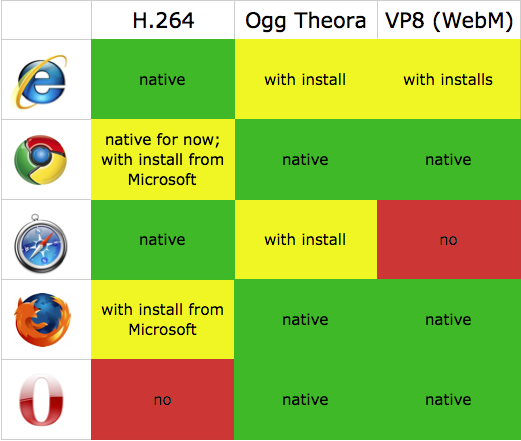

Fuente: [https://msdn.microsoft.com/es-es/hh552485.aspx](https://msdn.microsoft.com/es-es/hh552485.aspx)

En Septiembre de 2015 Microsoft ha anunciado que dotará en el futuro de soporte nativo a VP8 en su navegador Edge, lo que da buenas esperanzas para la estandarización mediante este formato.

La solución pasa por incluir en la etiqueta `<video>` o `<audio>` varias fuentes con diferentes codificaciones, pero el mismo contenido, de manera que el navegador seleccione el que sea compatible. Un ejemplo de cómo se consigue esto es el siguiente:

```html
<video controls>
  <source src="devstories.webm" 
          type='video/webm;codecs="vp8, vorbis"'/>
  <source src="devstories.mp4"
          type='video/mp4;codecs="avc1.42E01E, mp4a.40.2"'/>
</video>

```

Por lo demás, a estas alturas el uso general de etiquetas y atributos debe ser bastante conocido, por lo que si queremos hacer un uso complejo de `<video>` o `<audio>`, solo nos queda investigar las referencias a todos los atributos específicos de estas:

[https://developer.mozilla.org/en-US/docs/Web/Guide/HTML/Using_HTML5_audio_and_video](https://developer.mozilla.org/en-US/docs/Web/Guide/HTML/Using_HTML5_audio_and_video)

[http://www.html5rocks.com/en/tutorials/video/basics/](http://www.html5rocks.com/en/tutorials/video/basics/)

## Tipografías web

Las tipografías web requieren aclarar ciertos conceptos previos. En principio, podemos definir que un texto utilice una tipografía mediante la propiedad CSS `font-family`. Pero solo tendrá en cuenta tipografías muy genéricas, o aquellas que ya están instaladas en el ordenador.

Si lo que queremos es utilizar una tipografía original, CSS3 define un estándar para enlazar nuestra web con el fichero tipográfico con la información necesaria para representarla. Pero de nuevo aquí hay varios estándares y no ha habido un acuerdo definitivo sobre qué formato utilizar, por lo que lo más sencillo es delegar este problema en servicios de tipografía web como el gratuito **Google Fonts** o **Adobe Typekit**.

[https://www.google.com/fonts](https://www.google.com/fonts)

[https://typekit.com/](https://typekit.com/)

Utilizando el primero como ejemplo, podemos buscar una tipografía que nos parezca interesante para nuestra página. Para utilizarla, deberemos enlazar en la sección `<head>` de nuestro documento con la ubicación de la tipografía de la manera:

```html
<link href='https://fonts.googleapis.com/css?family=Lobster' rel='stylesheet' type='text/css'>
```

Y luego en el fichero CSS, tendremos que agregar la siguiente regla en el selector al que queramos dotar de esta tipografía:

```css
font-family: 'Lobster', cursive;
```

El especificar `cursive` como fuente alternativa permitirá que si por alguna razón no se puede utilizar la primera opción indicada, haya una segunda con una visualización diferente a la que tienen por defecto otros elementos de la página.


### Compatibilidad en navegadores, arreglos de fallos conocidos

Un problema que nunca hay que olvidar, es que cada navegador puede representar nuestro código HTML y CSS de formas distintas. Esto presenta un problema en tres situaciones:

* El navegador es muy antiguo, por lo que representa de forma diferente elementos muy básicos ya que anteriormente había poco compromiso por las empresas desarrolladoras de respetar los estándares web.
* El navegador es antiguo, y no sabe interpretar algunos nuevos elementos de HTML5 y CSS3
* El navegador no es antiguo, pero ciertos elementos de HTML5 y CSS3 todavía no los interpreta de la misma manera de otros navegadores (o no está bien definido el estándar de cuál es el comportamiento más correcto).

Una muy buena referencia de cómo una característica web funciona en diferentes navegadores y sus versiones es la siguiente:

* [http://caniuse.com/](http://caniuse.com/)

Una problemática habitual es que algunos navegadores introducen características de HTML5 y CSS3 cuando todavía están en borrador. Para asegurarse que no rompen otros códigos válidos, lo que hacen es anteponer a las reglas CSS un prefijo con un guión y las siglas de su navegador. Por esto en muchos ejemplos sacados de Internet nos encontramos reglas repetidas, en cada copia con diferente prefijo, de forma que nos aseguremos que todos los navegadores lo entienden. Un código de este tipo sería el del siguiente ejemplo para definir el fondo como un gradiente:


```css
background: #1e5799; /* Old browsers */
background: -moz-linear-gradient(top, #1e5799 0%, #7db9e8 100%); /* FF3.6+ */
background: -webkit-gradient(linear, left top, left bottom, color-stop(0%,#1e5799), color-stop(100%,#7db9e8)); /* Chrome,Safari4+ */
background: -webkit-linear-gradient(top, #1e5799 0%,#7db9e8 100%); /* Chrome10+,Safari5.1+ */
background: -o-linear-gradient(top, #1e5799 0%,#7db9e8 100%); /* Opera 11.10+ */
background: -ms-linear-gradient(top, #1e5799 0%,#7db9e8 100%); /* IE10+ */
background: linear-gradient(to bottom, #1e5799 0%,#7db9e8 100%); /* W3C */
filter: progid:DXImageTransform.Microsoft.gradient( startColorstr='#1e5799', endColorstr='#7db9e8',GradientType=0 ); /* IE6-9 */
```

La primera regla se incorpora para asegurar que en el peor de los casos, el elemento tendrá al menos un color de fondo sólido. La última está preparada para versiones antiguas de Internet Explorer, donde a pesar de no contar con ningún soporte para esta funcionalidad, se puede emular mediante filtros DirectX que solo este navegador interpreta.

**Los ejemplos así construidos son muy compatibles, pero largos y engorrosos de estudiar, por lo que en este manual solo especificaremos en todos los casos la versión de código más compatible (en este ejemplo, la marcada como W3C), quedando como labor para el alumno asegurarse si funciona en otros navegadores, y proporcionar los códigos adicionales equivalentes.**

Como referencia para evaluar nuestras páginas frente a navegadores, además de comprobar directamente con aquellos que tengamos instalados, podemos utilizar servicios externos como **BrowserStack**, que realiza una batería de pruebas y nos envía los resultados como capturas de pantalla por email:

* [https://www.browserstack.com/screenshots](https://www.browserstack.com/screenshots)

Ya comentamos antes también que Internet Explorer y Edge, al desplegar con F12 el inspector de código, permiten seleccionar si queremos ver cómo se visualiza la página actual en versiones anteriores del navegador de Microsoft.

Cuando un navegador no implemente una características estándar de CSS3 o HTML5, podemos utilizar librerías JavaScript que añadan esa funcionalidad. Este tipo de herramientas sustitutivas se llaman **Polyfill**, y una de las más utilizadas es Modernizr:

* [http://modernizr.com/](http://modernizr.com/)

La necesidad de asegurar la compatibilidad en navegadores y en qué versiones deberá ser evaluada antes de comenzar cada proyecto. Cuanto más compatible queremos que sea la página, sobre todo con navegadores antiguos, más trabajo de revisión y búsqueda de alternativas a las incompatibilidades deberemos realizar. Esta es una labor bastante compleja, que queda para estudio particular una vez se haya asimilado el uso correcto de los estándares en las situaciones más favorables.


### Validadores, Preprocesadores

Hemos dado un vistazo a las sintaxis de HTML y CSS, las etiquetas y propiedades más utilizadas, y por donde expandir nuestro conocimiento de ellas. Un par de referencias adicionales para completar este capítulo son las de los validadores y preprocesadores.

Si durante los ejemplos has escrito alguno mal y has comprobado el resultado en el navegador, habrás visto que se desbarata toda la visualización de la página. Pero también puedes haber comprobado que pequeños errores u omisiones son corregidos de forma automática por el navegador, de forma que en el inspector de código el resultado que éste visualiza es la mejor aproximación que ha conseguido hacer al código correcto.

Para comprobar que nuestro fichero carece de estos pequeños errores, que pueden convertirse en errores graves o incompatibilidades en navegadores, podemos utilizar el servicio de validación del W3C

* [https://validator.w3.org/](https://validator.w3.org/)

* [http://jigsaw.w3.org/css-validator/](http://jigsaw.w3.org/css-validator/)

Los preprocesadores son otra herramienta útil, que nos permite definir código CSS pero en un lenguaje previo, como LESS o SASS, de manera que podamos añadir a nuestra especificación visual el uso de variables y expresiones.

Gracias a esto, si necesitamos cambiar un atributo como un color utilizado en varios sitios de la especificación de los estilos, tan solo tendremos que cambiarlo una vez en la especificación de la variable.

Un ejemplo de sintaxis de LESS

```css
@lightRed:   #fdd;
@lightGreen: #dfd;
@lightBlue:  #ddf;

@defaultThemeColor:@lightGreen;
.shape{
    display:inline-block;
    width:200px;
    height:200px;
    background:@defaultThemeColor;
    margin:20px;
}
```

Otro ejemplo de sintaxis de SASS.

```scss
$font-stack:    Helvetica, sans-serif;
$primary-color: #333;

body {
  font: 100% $font-stack;
  color: $primary-color;
}
```

Eso si, será necesario que generemos el fichero CSS a partir del código LESS o SASS previamente a su utilización, con herramientas llamadas “preprocesadores de CSS”, y a la acción de generar el fichero CSS, “compilación”. Más referencias en:

* [http://sass-lang.com/](http://sass-lang.com/)

* [http://lesscss.org/](http://lesscss.org/)


---
[Siguiente >>](./2.md){:class="solid-btn text-center"}