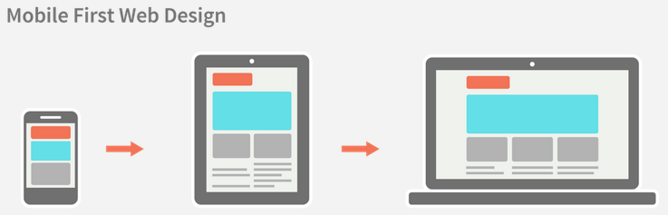

[<< Volver al listado completo](../)

# Desarrollo web con HTML, CSS y JavaScript

## Módulo 2: Responsive Web Design

### ¿Qué es el RWD?

Responsive Web Design (RWD), o diseño responsivo, es la tendencia moderna en cuanto a desarrollo de páginas web, según la cual se diseña una única página con una misma codificación, que debe adaptarse a los diferentes dispositivos en cuanto a tamaños de pantalla, densidad de píxeles, orientación vertical u horizontal, y elementos de interacción como ratón o pantalla táctil.

Los primeros teléfonos que contaron con navegadores de Internet tenían poca potencia, un tamaño de pantalla muy pequeño, y estos navegadores podían realizar pocas funciones. Por esto era práctica común detectar si el navegador correspondía a un móvil para enviarle una versión diferente de la página, mucho más sencilla y con pocas funciones.

Pero hoy en día los móviles y tablets tienen resoluciones en muchos casos superiores a los ordenadores. Su pantalla puede utilizarse en horizontal o vertical, y no contamos con cursores o ratón para desplazarnos o seleccionar elementos, sino que tenemos que hacerlo pulsando con el dedo (las zonas táctiles tiene por tanto que tener mayor tamaño).

En muchos casos se mantenía esa versión móvil más limitada de las páginas, lo que ofrecía una experiencia de usuario horrible en dispositivos modernos.

El nuevo estándar CSS3 proporciona reglas que permiten construir un solo interfaz que, sin necesidad de recargar siquiera la página actual, se transforma en función del tamaño de la pantalla del navegador, de manera que proporcionamos al usuario la mejor representación posible de la página en todas las circunstancias.

Se teoriza que en el futuro el volverá el diseño adaptable, en el que se envía al navegador una versión específica adaptada a sus capacidades, pero con idea una vez más de proporcionar la mejor experiencia de usuario posible al navegante.


### Tamaños de pantalla y densidades

Necesitamos en primer lugar conocer las diferentes resoluciones de pantalla de los dispositivos que van a ser nuestro objetivo. Podemos consultar una extensa tabla en la siguiente referencia: 

* [http://dpi.lv](http://dpi.lv)

Comparemos algunas características de dispositivos como los siguientes:

<table>
  <tr>
   <td>
   </td>
   <td>Tamaño diagonal pantalla
   </td>
   <td>Resolución
   </td>
   <td>Densidad Píxeles por Pulgada (PPI)
   </td>
  </tr>
  <tr>
   <td>Monitor PC convencional
   </td>
   <td>21’’
   </td>
   <td>1980 x 1090
   </td>
   <td>166
   </td>
  </tr>
  <tr>
   <td>iPhone 6 Plus
   </td>
   <td>5,5’’
   </td>
   <td>1080x1980
   </td>
   <td>401
   </td>
  </tr>
  <tr>
   <td>Samsung Galaxy S6
   </td>
   <td>5,1’’
   </td>
   <td>1920x1080
   </td>
   <td>532
   </td>
  </tr>
  <tr>
   <td>iPad Air
   </td>
   <td>9,7’’
   </td>
   <td>2048 x 1536
   </td>
   <td>264
   </td>
  </tr>
</table>

Nos damos cuenta de que tan solo fijándonos en la resolución, no tenemos una información fidedigna de las características del sistema utilizado por el usuario. Un monitor de un PC convencional puede tener la misma resolución que un iPhone 6 o un Samsung Galaxy S6, pero al ser estas pantallas mucho más pequeñas (lo que se comprueba examinando la densidad de píxeles), al usuario le costaría mucho interactuar con la misma página si se representara de forma equivalente en estos dispositivos.

Además, una página diseñada para ordenador tiene en cuenta que la interacción principal se realizará con el ratón, donde la precisión del cursor es muy grande. En un dispositivo táctil, el tamaño de nuestros dedos sobre un móvil tiene un tamaño considerable, y sería deseable que los elementos a pulsar fueran de un tamaño similar a nuestra huella.


### Diseño Mobile First

Afrontar este reto de diseño no es fácil. Para ello está demostrado que es mucho más práctico adoptar una filosofía **mobile first**, donde en primer lugar se diseñe cómo se va a visualizar el contenido en un dispositivo móvil, de manera conceptual y creando el código HTML y CSS; para luego especificar cómo alteramos el interfaz para aprovechar las características de la visualización en escritorio.



Fuente: [http://metamonks.com/mobile-first-vs-responsive](http://metamonks.com/mobile-first-vs-responsive)

En general, el diseño mobile first debe tener en cuenta algunos patrones muy comunes de usabilidad:

* La cabecera no debe ser muy grande, de manera que el contenido no quede muy abajo.
* Los menús de navegación deberán aparecer condensados, desplegándose solo al pulsar alguna opción para ello.
* Un conjunto de artículos es apropiado mostrarlos de arriba a abajo, ocupando cada uno el 100% del ancho (o el 50% en dispositivos como tablets con algo más de tamaño).
* Cualquier contenido lateral no relacionado con el contenido principal, es mejor trasladarlo a que se muestre al pie del documento.
* Cualquier enlace que se podría mostrar como un texto, es preferible hacerlo como un botón que tenga un tamaño fácil de pulsar. 
* Si un artículo se puede expandir para visitar su contenido ampliado, hacer tanto el título como la imágen y el texto resumen del artículo “pulsables” para visitar la versión expandida de la misma.


### Cómo aplicar RWD, Media queries

Conseguir todo puede parecer muy complicado, pero en realidad se consigue siempre de la misma manera. Utilizaremos una nueva característica de CSS3 llama **media queries**.

Utilizando la palabra clave **media**, podemos establecer entre corchetes que un conjunto de reglas solo se tenga en cuenta para un medio en concreto (la pantalla, o la versión de impresión), o para un rango de resolución específico. En nuestro ejemplo podemos utilizar unas reglas como estas:

```css
@media screen and (max-width: 300px) {
    nav { display: none; }
    article {
        width: 100%; 
        height: 100px;
    }
}
```

En el resultado comprobamos al reducir el tamaño del navegador que el comportamiento de la lista de ejemplos ya no es conformar una red de 3 elementos de ancho, sino una lista donde todos tiene un ancho del 100%. También hemos ocultado el menú superior, aunque sería necesario añadir un menú alternativo desplegable.

Otro factor que tenemos que tener en cuenta, es que los dispositivos táctiles al facilitar el hacer zoom pellizcando la pantalla, pueden mostrar un ancho de ésta diferente del ancho del documento. Para forzar a que el documento se muestre exactamente con el ancho de la pantalla, utilizaremos una etiqueta `<meta>` en la cabecera como esta:

```html
<meta name="viewport" content="width=device-width">
```

El ejemplo anterior nos ha funcionado reduciendo el tamaño del navegador, y funcionaría con pantallas de poca resolución. Pero los dispositivos de pantalla tipo “retina”, con muchos pixels por pulgada, requerirán reglas en las que utilicemos este factor en lugar del ancho en píxeles.

```css
@media
  only screen and ( min-device-pixel-ratio: 2),
  only screen and ( min-resolution: 192dpi),
  only screen and ( min-resolution: 2dppx) { 
    /* Reglas para dispositivos retina */
}
```

Definir todas estas particularidades poco a poco es posible, pero siempre es mejor utilizar plantillas o ejemplos ya construidos y aplicarlos al completo. Veremos en la sección sobre Bootstrap como beneficiarnos de un montón de reglas preconstruidas para que las utilicemos de manera sencilla sin tener que definir apenas nada en el CSS.


### Ratio de píxeles, densidad de pantalla, imágenes de alta resolución

Hemos visto cómo afecta tanto el ratio de píxeles de la pantalla como la densidad para la experiencia a la hora de construir CSS. Pero, ¿qué pasa con las imágenes?

En una pantalla de mucha resolución pero pequeño tamaño, vamos a querer ampliar la imagen respecto al tamaño de píxel de un ordenador de escritorio. Pero si lo hacemos utilizando la misma imagen original, estaremos desaprovechando la mayor resolución a nuestra disposición.

La solución está en utilizar ficheros de imagen alternativos para pantallas de alta densidad. Cuando se definan mediante CSS y media queries, tenemos que especificar en estas reglas alternativas los nuevos ficheros como cualquier otra regla particular para esa resolución. Más referencias en:

* [http://www.html5rocks.com/en/mobile/high-dpi](http://www.html5rocks.com/en/mobile/high-dpi)

Cuando los utilicemos en etiquetas ``, podemos emplear la propiedad `srcset` para especificar un conjunto de alternativas a la imagen original definida en la propiedad `src`.

Un ejemplo de uso de `srcset` sería el siguiente:

```html

```


---
[Siguiente >>](./modulo3.md)