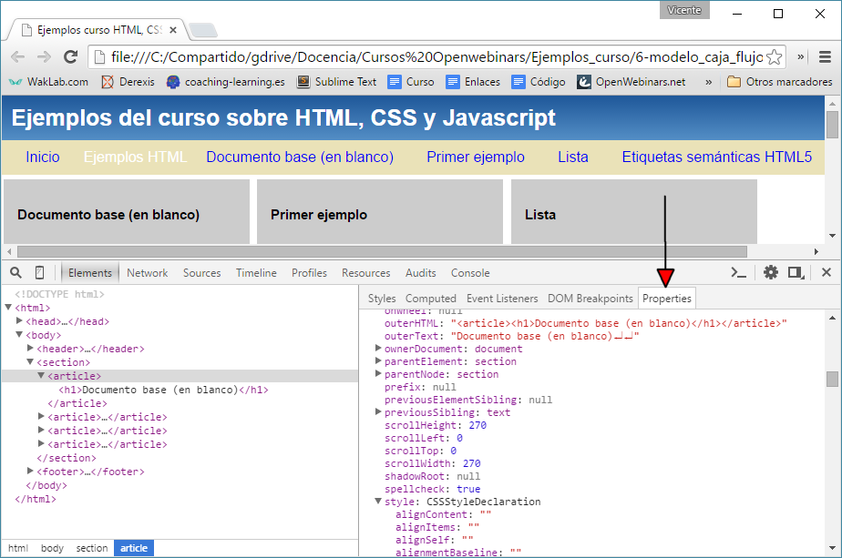
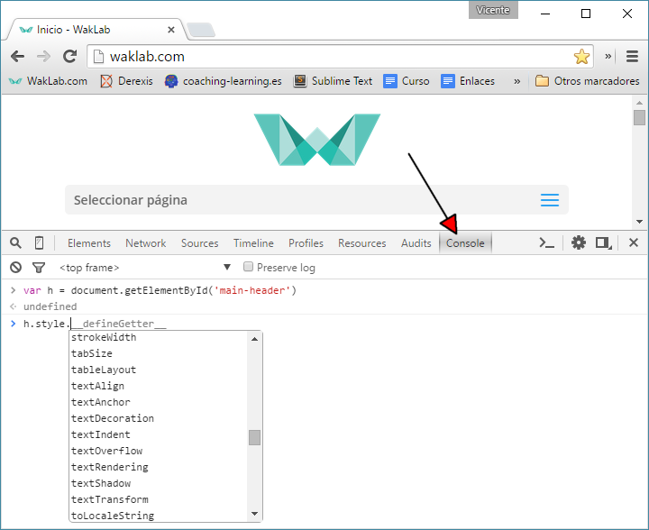
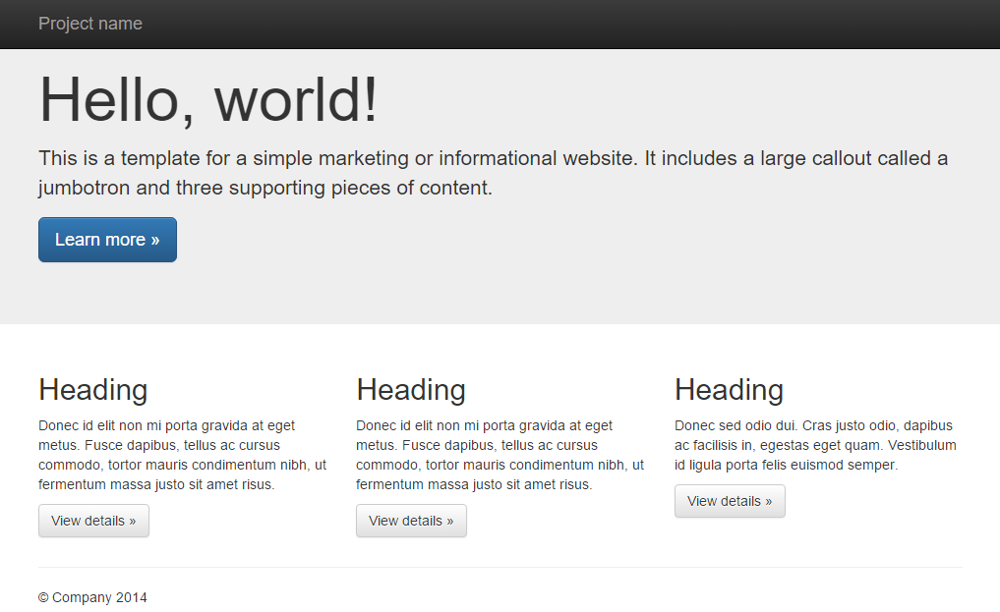
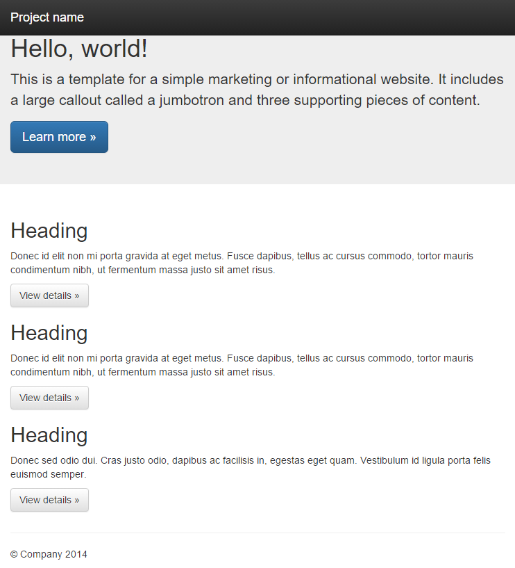
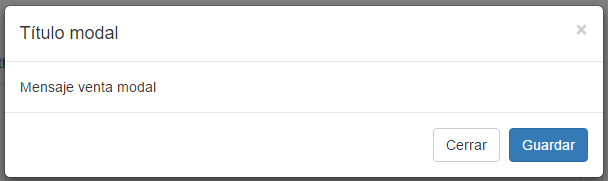

[<< Volver al listado completo](../)

# Desarrollo web con HTML, CSS y JavaScript

## Módulo 3: Frameworks y JavaScript

### Introducción a JavaScript

Ahora que tenemos forma de definir el contenido de la página en HTML, y el aspecto visual en CSS, vamos a añadir algo de programación mediante JavaScript.

Al igual que pasara con CSS, tenemos varias formas de incorporar código JavaScript a nuetro fichero HTML.

**1. Referenciando un fichero .js en la cabecera `<head>`**

```html
<script src="mificherojs.js" type="text/javascript" />
```

Especificar el atributo `type` es opcional en HTML5, ya que por defecto se asume que es JavaScript.

**2. Incorporando código incrustado en cualquier parte de la página mediante la etiqueta &lt;script>**

```html
<script type="text/javascript">
	alert('Hola Mundo');
</script>
```

Este código se ejecuta siempre inmediatamente en el momento que el navegador lo recibe, aunque no haya terminado de procesar el documento HTML completo.

**3. Incorporando código directamente dentro de una etiqueta, como valor de un atributo de evento**

```html
<a href="#" onclick="javascript: alert('Hola Mundo');">Saludar</a>
```

### Variables, funciones, operadores

El leguaje JavaScript es muy directo y convencional a la hora de definir variables, funciones y operadores. La sintaxis es parecida a C, C++ y C#, e incluso un poco a PHP.

Cada instrucción se termina en `;`, y los carácteres `{`  y `}` se utilizan para delimitar el ámbito de las funciones y otros elementos como objetos JSON (los veremos más adelante).

```html
<script>
	function muestrasuma(numero1, numero2) {
		var resultado;
		resultado = numero1 + numero2;
		alert(resultado);
	}

	muestrasuma(10, 2);
</script>
```

Las variables en JavaScript no tienen un tipo determinado, por lo que habrá que tener mucho cuidado a la hora de mezclar diferentes tipos de datos en las operaciones


### Cadenas, arrays

Las cadenas de texto en JavaScript son objetos complejos, que incorporan toda una serie de métodos para manipularlas. La concatenación de cadenas se realiza con el operador `+`.

Las cadenas pueden estar definidas utilizando comillas simples o dobles, siempre que se utilice el mismo tipo de comillas para abrir y cerrar la cadena.

```html
<script>
var a = "Hola";
var b = "Mundo";
alert(a + " " + b);
</script>
```


### Manipulación del DOM, eventos

En JavaScript ejecutado desde un documento HTML, contamos con toda una serie de objetos y sus métodos predefinidos que representan todos los objetos visuales del documento, de manera que podamos manipularlos con facilidad. A esto se le llama **Document Object Model (DOM)**.

El objeto `document` que representa a todo el documento cuenta con un método `getElementById`, que devuelve un objeto especificando su atributo id, para que luego podamos manipularlo.


```html
<a href="#" id="mienlace">Enlace demo</a>
<script>
document.getElementById("mienlace").style.backgroundColor="orange";
</script>
```


### Objetos, propiedades y métodos

JavaScript es un lenguaje que además de ser funcional (permite la declaración directa de funciones) también es “basado en objetos”.

Para aquellos que tengan nociones de orientación a objetos, decir que la diferencia en ser “basado en objetos”, es que carecemos de mecanismos sencillos en el lenguaje para definir clases y herencias, y exigir comprobaciones de pertenencia a dichas clases.

Si todo esto no te dice nada, no te preocupes. Lo importante es que en JavaScript en el navegador el **DOM **nos proporciona toda una serie de objetos equivalente a todos los elementos de la página web, que están atribuidos con sus respectivas propiedades equivalente según se ven en cada momento en la página.

Gracias al DOM cualquier cambio que hagamos en estos objetos se traduzca automáticamente en un cambio en la representación visual del mismo en la web.

Pero, ¿cómo se utiliza esto para programar? ¿cómo se acceden a estos objetos y métodos? En primer lugar, partimos de un objeto principal llamado `document`, que contiene a todo el documento HTML.

Éste tiene un método `getElementById` que nos permite obtener un objeto concreto del documento, sabiendo su identificador. A partir de ahí, podríamos por ejemplo acceder a la propiedad `style` que define todos los estilos CSS del objeto, y de nuevo a la propiedad `border`, que permite definir un nuevo estilo para el borde. En conjunto, todo esto se hace con la siguiente linea de código:

```javascript
document.getElementById('menu-principal').style.border = '1px solid red';
```
Un truco muy común es cambiar la propiedad CSS `display` de un objeto de `block` para que sea visible, a `none` para que quede oculto. Esto lo podríamos conseguir así:

```javascript
document.getElementById('menu-principal').style.display = 'none';
```

La consola de código de Chrome es muy útil a la hora de explorar las propiedades JavaScript que tiene un objeto, para ello habrá que seleccionar el nodo que queremos inspeccionar, y pulsar en la pestaña de la derecha llamada **Properties**.



Otro truco útil es utilizar la **consola JavaScript** del inspector de código. Cuando en ella escribimos código JavaScript, se ejecuta inmediatamente sobre la página actual. Para los diferentes objetos del DOM, si los almacenamos en una variable nos ofrece además completación inteligente del código.



Unas buenas referencias al DOM las podéis encontrar en las siguientes webs:

* [https://developer.mozilla.org/es/docs/DOM](https://developer.mozilla.org/es/docs/DOM)

* [http://www.w3.org/DOM/DOMTR](http://www.w3.org/DOM/DOMTR)

* [http://www.w3schools.com/js/js_htmldom.asp](http://www.w3schools.com/js/js_htmldom.asp)


### Funciones anónimas, lambdas, scope

En JavaScript es posible definir como parámetro, en lugar de un valor para una variable, directamente una función anónima a ejecutar. Piensa por ejemplo en un método de evento, que nos está pregunta “¿Qué función ejecuto al pulsar esto?”, y la respuesta no es el nombre de la función, sino directamente la función.

Como cada función define su propio ámbito, donde las variables definidas no afectan al resto del código, muchas veces se definen directamente sin que se haya pedido una función anónima que se ejecuta directamente, solo para asegurarnos que el código que contiene no afecta a las variables definidas fuera de ésta.

```javascript
<script>
(function(){
    alert('Función anónima para aislar el ámbito');
})();
</script>
```


### Depurador JavaScript del navegador

Obviamente el inspector de código del navegador permite revisar el código JavaScript incorporado en el documeto así como el referenciado en archivos externos.

Además siempre contamos con una **consola** de código, donde se mostrará cualquier error JavaScript ocurrido, o cualquier mensaje enviado a la consola mediante `console.log()` (no disponible en versiones antiguas de Internet Explorer).

La consola nos permite también introducir comandos JavaScript sobre la marcha, en el mismo entorno de la página en el que se está ejecutando todo nuestro JavaScript principal, por lo que es fácil probar comandos o incluso pegar grandes trozos de código para comprobar su efecto antes de incorporarlo en los ficheros.

También contamos siempre con un avanzado depurador, que nos permite incorporar puntos de interrupción al código, que detendrán la ejecución del código JavaScript al llegar a ellos, permitiéndonos inspeccionar el contenido de las variables, o utilizar la consola para realizar pruebas sobre ese punto concreto del código. No es difícil de utilizar si ya has utilizado antes un depurador de código en cualquier otro lenguaje de programación.


### Anexo: Minificadores de código

El código JavaScript, así como HTML y CSS, permite utilizar espacios y tabulaciones para separar el contenido de forma que esté más organizado, y sea más sencillo entender a simple vista su estructura.

Todos estos espacios en realidad no aportan nada al navegador, por lo que podríamos pensar en una versión equivalente de estos ficheros donde se omitieran, ganando a cambio algo de reducción de tamaño de ficheros. Cuando tenemos miles de usuarios cargando el contenido de nuestras páginas, esta reducción puede suponer un gran ahorro.

Otro efecto importante de cara a la carga de la página, es que es más óptimo cargar un solo fichero CSS o JS grande, que muchos ficheros separados pequeños. Como también por orden podemos querer tenerlos separados, otra optimización posible es juntar todos estos pequeños ficheros en uno solo.

Si estamos utilizando un CMS, estos tienen a su disposición herramientas o plugins que permiten automatizar estos procesos.


### Un vistazo a las APIs HTML5

Las funcionalidades que nos ofrece el DOM son muy amplias, pero dada la complejidad que a día de hoy se le exigen a las páginas webs, se han incoporado a HTML5 una serie de APIs adicionales que permiten una programación de funcionalidades más compleja.

A continuación incluimos un listado de las mismas junto con una descripción para que sirva de referencia frente a profundizar más con alguna de ellas:

* **Canvas**: Librería que permite la realización de dibujos complejos y animaciones en zonas específicas de la página con la etiqueta `<canvas>`
* **Drag&Drop**: Ofrece una gestión unificada de la funcionalida de arrastrar y soltar en el navegador, independiente de cuál se trate y del sistema operativo.
* **Geolocation**: Permite relizar consultas para solicitar el geoposicionamiento del usuario.
* **Storage**: Ofrece mecanismos para el almacenamiento y consulta de grandes cantidades de información, como con una base de datos.
* **File**: Gestión de la interacción con el sistema de ficheros.
* **Communication**: Apertura de puertos (sockets) para la comunicación directa con otras aplicaciones.
* **Web workers**: Facilita el definir procesos que serán realizados en segundo plano mientras continua la ejecución principal del código.
* **History**: Ofrece una interfaz común para la gestión del historial del navegador, para aquellas web cuya funcionalidad no requiera ir cargando páginas nuevas.
* **Offline**: Funcionalidad para ofrecer soporte al trabajo sin conexión de la página, como si se tratase de una aplicación cualquiera.


### Librerías JavaScript, Librería jQuery

No tenemos que crear todo el código que necestemos en JavaScript por nosotros mismos, podemos apoyarnos en el uso de librerías JavaScript que ponen en nuestras manos una gran cantidad de código y facilidades para su uso. Entre las principales librerías están:

* **jQuery**: Una de las más utilizadas, ofrece funcionalidades de base muy interesantes que veremos más adelante. Dispone de componentes visuales a través de otras librerías adicionales como jQuery UI y jQuery Mobile.  
 [https://jquery.com](https://jquery.com)
* **ExtJS**: Un sistema de Widgets que permite construir interfaces y aplicaciones web tan complejas como una aplicación de escritorio. El único de esta lista que no es software libre, requiriendo licencia para proyectos comerciales.  
 [https://www.sencha.com/products/extjs](https://www.sencha.com/products/extjs)
* **ReactJS**: Un complejo framework basado en el patrón MVC (modelo, vista, controlador), donde es posible utilizar tan solo la parte de “vista” para dibujar Widgets. Permite crear controles de interfaz de usuario con estado interno que reaccionan ante el cambio del mismo, actualizándose automáticamente.  
 [http://facebook.github.io/react](http://facebook.github.io/react)
* **Angular JS**: Otro complejo framework para construir aplicaciones web basadas en el patrón MVC (modelo, vista y controlador). Se utiliza programando en Typescript (una especie de variante de JavaScript más formal), se obtiene el mayor rendimiento con él cuando se utiliza su sistemática de trabajo para todo el desarrollo de la aplicación.  
 [https://angularjs.org](https://angularjs.org)


**jQuery**

Esta librería es la más utilizada en proyectos web, ofreciendo una serie de funcionalidades básicas sobre las cuales otras librerías pueden complementar con funciones más complejas (por ejemplo, añadiendo “widgets”, elementos visuales de interfaz de usuario).

En pocas palabras, jQuery permite especificar un selector de una forma equivalente a la que se utiliza en CSS, para sobre el conjunto de elementos seleccionados, realizar operaciones estándar DOM sobre ellas, u otras adicionales que jQuery proporciona.

En su origen, jQuery tenía la gran virtud de que estos métodos adicionales proporcionados eran compatibilizados respecto a todos los navegadores, permitiendo un código único, compacto y sencillo. Hoy en día los navegadores modernos se comportan muy bien respecto a los estándares, pero aún así jQuery ofrece una forma de programar cosas muy interesantes en solo un par de líneas muy comprensibles (ver [http://youmightnotneedjquery.com](http://youmightnotneedjquery.com) ).

Para utilizar jQuery, podemos descargarnos y enlazar la librería (normalmente ya minificada) desde [https://jquery.com](https://jquery.com), o bien podemos enlazar directamente con la que Google hospeda online para su uso por cualquiera utilizando la siguiente línea en la cabecera, lo que será más rápido:

```html
<script src="https://ajax.googleapis.com/ajax/libs/jquery/2.1.4/jquery.min.js"></script>
```

Más información sobre el hospedaje de librerías por Google en:

[https://developers.google.com/speed/libraries/?hl=es](https://developers.google.com/speed/libraries/?hl=es)

Si nos descantamos por esta última opción, es importante recordar que necesitaremos tener conexión a internet para que funcione nuestra funcionalidad con jQuery.

jQuery fundamenta en el uso del operador $, que como hemos mencionado, devuelve un elementos o elementos coincidentes con el selector CSS proporcionado.


```javascript
$('section#blogroll article ul').addClass('milista');
```

En el ejemplo anterior, obtendríamos todos los elementos de lista `<ul>` que estivueran dentro de artículos `<article>`, que a su vez estuvieran dentro de el elemento `<section>` con identificador `blogroll`. A estos elementos, le añadiríamos la clase CSS `milista`, en adición a cualquier clase que tuvieran ya establecida. 

A continuación una serie de llamadas de ejemplo de jQuery nos permiten comprobar qué tipo de cosas se pueden hacer con esta librería:

```javascript
//Retirar clase CSS
$(el).removeClass(className);

//Ocultar elemento/s
$(el).hide();

//Mostrar elemto/s
$(el).show();

//Ejecuta una función sobre cada elemento
$(selector).each(function(i, el){
    //...
});

//Coincide con selector
$(el).is('.my-class');

//Obtener coordenadas
$(el).offset();

//Establecer estilo
$(el).css('border-width', '20px');

//Añadir evento Off
$(el).off(eventName, eventHandler);

//Añadir evento On
$(el).on(eventName, eventHandler);

//Ejecutar cuando el documento HTML esté preparado
$(document).ready(function(){
    //...
});
```


### Los frameworks Web

Para complementar la reuitilización de una base a la hora de trabajar en proyectos web, además de las librerías JavaScript, contamos con los **frameworks web**, que proporcionan definiciones CSS de base (también llamadas “boilerplate”), para definir cabeceras, mensajes popup, distribuciones en columnas, etc. Estas además están perfectamente diseñadas para un comportamiento **responsive** frente al paradigma del diseño **mobile first**.

Entre estos frameworks, los más utilizados son:

* **BootStrap**: Desarrollado por Twitter como software libre, el más utilizado. Integra sistema de rejilla responsive, normalización frente a diferencias entre navegadores, clases para elementos visuales comunes, un tema de colores y tipografía, y opcionalmente algunos widgets jQueryUI. Hablaremos extensivamente de él más adelante.
* **Foundation**: Similar a Bootstrap, es compatible con navegadores más antiguos, y su estilo visual es más sobrio y funcional.
* **HTML Kickstart**: Además del framework, contamos con modelos en Photoshop de todos los elementos de interfaz de usuario para ser utilizados en la creación de bocetos por los diseñadores.
    * [http://www.99lime.com/elements](http://www.99lime.com/elements)

Además de estos, existen otros frameworks más complejos que aúnan además a su vez AngularJS o ReactJS.


### Uso de BootStrap

Podemos descargar Bootstrap de su página para enlazar con los ficheros CSS y JS necesarios, o bien al igual que con jQuery, podemos utilizar una fuente externa (en este caso de MaxCDN), para enlazar directamente con los ficheros de BootStrap alojados por ellos, incluyendo este código en la cabecera `<head>` de la siguiente forma:


```html
<!-- Última versión compilada y minificada de CSS -->
<link rel="stylesheet" href="https://maxcdn.bootstrapcdn.com/bootstrap/3.3.5/css/bootstrap.min.css">

<!-- Tema opcional -->
<link rel="stylesheet" href="https://maxcdn.bootstrapcdn.com/bootstrap/3.3.5/css/bootstrap-theme.min.css">
```

Una vez hecho esto, podemos escribir el código HTML que deseemeos, y utilizar las clases y utilidades que nos ofrece.

Tomemos como ejemplo el siguiente código para &lt;body>, modificado desde uno de los propios ejemplos proporcionados en la página de BootStrap:

```html
<nav class="navbar navbar-inverse navbar-fixed-top">
  <div class="container">
    <div class="navbar-header">
      <a class="navbar-brand" href="#">Project name</a>
    </div>
  </div>
</nav>
<!-- Main jumbotron for a primary marketing message or call to action -->
<div class="jumbotron">
  <div class="container">
    <h1>Hello, world!</h1>
    <p>This is a template for a simple marketing or informational website. It includes a large callout called a jumbotron and three supporting pieces of content.</p>
    <p><a class="btn btn-primary btn-lg" href="#" role="button">Learn more &raquo;</a></p>
  </div>
</div>
<div class="container">
  <!-- Example row of columns -->
  <div class="row">
    <div class="col-md-4">
      <h2>Heading</h2>
      <p>Donec id elit non mi porta gravida at eget metus. Fusce dapibus, tellus ac cursus commodo, tortor mauris condimentum nibh, ut fermentum massa justo sit amet risus. </p>
      <p><a class="btn btn-default" href="#" role="button">View details &raquo;</a></p>
    </div>
    <div class="col-md-4">
      <h2>Heading</h2>
      <p>Donec id elit non mi porta gravida at eget metus. Fusce dapibus, tellus ac cursus commodo, tortor mauris condimentum nibh, ut fermentum massa justo sit amet risus.</p>
      <p><a class="btn btn-default" href="#" role="button">View details &raquo;</a></p>
   </div>
    <div class="col-md-4">
      <h2>Heading</h2>
      <p>Donec sed odio dui. Cras justo odio, dapibus ac facilisis in, egestas eget quam. Vestibulum id ligula porta felis euismod semper.</p>
      <p><a class="btn btn-default" href="#" role="button">View details &raquo;</a></p>
    </div>
  </div>
  <hr>
  <footer>
    <p>&copy; Company 2015</p>
  </footer>
</div> <!-- /container -->
```

Comprobamos que tenemos una barra superior, un encabezado grande, y tres elementos en tres columnas para terminar con un breve pie. Además los enlaces aparecen estilados como atractivos botones.



Para ello, hemos utilizado las siguentes clases CSS:

* `navbar` y derivados: definición de la barra superior
* `jumbotron`: encabezado con letras grandes
* `btn` y derivados: estilado de un enlace como un botón.
* `row`: define el comienzo de una fila (en el ejemplo tan solo hay una).
* `col-md-4`: Establece que tendremos 3 columnas del mismo ancho (el número 4 de la clase es engañoso, no tiene nada que ver con la distribución de columnas), y que en dispositivos móviles se reduciran a una para aumentar la legibilidad. 

No es necesario que memoricemos estas clases. Tenemos un listado con ejemplos de todos los elementos visuales de tema con ejemplos en la siguiente referencia:

* [http://getbootstrap.com/examples/theme](http://getbootstrap.com/examples/theme)

Cambiando las clases que definimos en las columnas, podemos hacer que se repartan en proporciones diferentes de ancho. También podemos añadir clases adicionales que modifican únicamente el comportamiento que tendrán estas columnas solo para dispositivos móviles. Tenemos ejemplos de las diferentes composiciones de rejillas en filas y columnas en las referencias:

* [http://getbootstrap.com/examples/grid](http://getbootstrap.com/examples/grid)

* [http://getbootstrap.com/2.3.2/scaffolding.html](http://getbootstrap.com/2.3.2/scaffolding.html)

Un resumen teórico del “Bootstrap schafolding” (grid system) muy asequible lo encontraréis en:

* [http://www.w3schools.com/bootstrap/bootstrap_grid_system.asp](http://www.w3schools.com/bootstrap/bootstrap_grid_system.asp)

El aspecto de este mismo ejemplo cuando reducimos el ancho del navegador, está totalmente adaptado a una perspectiva de uso de dispositivos móviles, sin que hayamos tenido que hacer nada más para ello:



Si quieres más información sobre cómo comenzar a utilizar BootStrap, puedes consultar su página en:

* [http://getbootstrap.com/getting-started](http://getbootstrap.com/getting-started)


### Modificando BootStrap

Hemos visto que podemos trabajar con BootStrap aplicando al 100% las clases que ya define, sin tener que construir ningún código CSS por nuestra parte para personalizar el aspecto de los elementos.

También es posible añadir reglas CSS propias que modifiquen de forma particular algún elemento. Para hacer esto, tan solo tendremos que añadir nuestra hoja de estilos en `<head>` al final de las de BootStrap (para que se apliquen en segundo lugar, y puedan sobreescribir comportamientos previos).

Pero habrá que tener mucho cuidado, ya que las reglas de BootStrap son complejas, y tienen en cuenta la representación de los elementos en todo tipo de resoluciones. Una práctica obligatoria será comprobar siempre que las modificaciones que realicemos no rompen la correcta visualización en resoluciones menores que la del escritorio (o mayores densidades de píxeles) para dispositivos.

Siempre es mejor construir clases adicionales que añadamos a las ya existentes para un elemento. Un ejemplo lo podemos encontrar en la web [translate.twitter.com](https://translate.twitter.com), en la que para personalizar un botón (definido por la clase `btn`), han creado una clase propia llamada `btn-tt`:

```css
/* Modificar el texto y el color de fondo en los tres estados
   principales del botón: default, hover y active. */
.btn-ttc,
.btn-ttc:hover,
.btn-ttc:active {
  color: white; background-color: #007da7;
  text-shadow: 0 -1px 0 rgba(0, 0, 0, 0.25);
}
 
/* Fondo con gradiente de colores */
.btn-ttc {
  background-repeat: repeat-x;
  background-image: linear-gradient(top, #009ED2 0%, #007DA7 100%);
}
```

Si creamos dos botones con el estilo por defecto, y el especificado por nuestra nueva clase, notaremos la diferencia:

```html
<a class="btn btn-default" href="#" role="button">View details &raquo;</a>
<a class="btn btn-ttc" href="#" role="button">View details &raquo;</a>
```

Y el resultado del botón usando el estilo por defecto, y el especificado por nosotros:


Existen herramientas que nos permiten de manera sencilla modificar los colores del tema base de BootStrap de manera visual, y obtener el fichero CSS resultante de la nueva especificación, como la de la siguiente referencia: [http://stylebootstrap.info](http://stylebootstrap.info)

También podemos revisar y descargar temas alternativos ya creados desde repositorios como el siguiente gratuito: [http://bootswatch.com](http://bootswatch.com)

Incluso existen editores visuales donde podemos construir la totalidad de la web basada en BootStrap sin tener que escribir una sola linea de código, aunque es un servicio en la nube que no ofrece un plan gratuito: [https://jetstrap.com](https://jetstrap.com)

Otra alternativa es modificar los ficheros de variables del tema que viene con BootStrap. Éste no está directamente codificado en CSS, sino en un lenguaje intermedio llamado LESS que permite utilización de variables y expresiones, con el que luego se generan los ficheros CSS.

Un fichero a modificar en LESS para alterar los colores sería `variables.less`:

* [https://github.com/twbs/bootstrap/blob/master/less/variables.less](https://github.com/twbs/bootstrap/blob/master/less/variables.less)

También podemos crear nuestros propios ficheros LESS, y seleccionar qué módulos de BootStrap vamos a utilizar para generar desde los ficheros LESS originales solo el código CSS estríctamente necesario, lo que nos aportará rapidez en la descarga de la página, y mayor fluidez en su funcionamiento.


### Uso de jQuery con BootStrap

Algunos de los plugins de BootStrap requieren jQuery, pero su uso es opcional. Si lo queremos incorporar, así como todos los plugins compilados en un solo fichero, tendremos que añadir en el cuerpo del documento:

```html
<!-- jQuery (necesario para alguno de los plugins) -->
<script 
   src="https://ajax.googleapis.com/ajax/libs/jquery/1.11.3/jquery.min.js"></script>

<!-- Última versión compilada y minificada de JavaScript -->
<script 
   src="https://maxcdn.bootstrapcdn.com/bootstrap/3.3.5/js/bootstrap.min.js"></script>
```

Existen muchas cosas en la web que no se pueden conseguir solo con HTML y CSS, y BootStrap incorpora ciertos plugins de uso común en JavaScript para seguir facilitándonos el trabajo.

Uno de ellos nos permite dibujar una ventana “modal”, que se muestre encima de nuestra web.

```html
<!-- Botón que lanza ventana modal -->
<button type="button" class="btn btn-primary btn-lg" data-toggle="modal" data-target="#myModal">
  Lanzar ventana modal
</button>

<!-- Ventana modal -->
<div class="modal fade" id="myModal" tabindex="-1" role="dialog" aria-labelledby="myModalLabel">
  <div class="modal-dialog" role="document">
    <div class="modal-content">
      <div class="modal-header">
        <button type="button" class="close" data-dismiss="modal" aria-label="Close"><span aria-hidden="true">&times;</span></button>
        <h4 class="modal-title" id="myModalLabel">Título modal</h4>
      </div>
      <div class="modal-body">
        Mensaje ventana modal
      </div>
      <div class="modal-footer">
        <button type="button" class="btn btn-default" data-dismiss="modal">Cerrar</button>
        <button type="button" class="btn btn-primary">Guardar</button>
      </div>
    </div>
  </div>
</div>
```

Al probar el ejemplo y pulsar el botón etiquetado “Lanzar ventana modal”, aparecerá sobre nuestra página una ventana con el siguiente mensaje:



Otras funcionalidades que podemos encontrar en JavaScript con BootStrap son:

* Dibujado menús dropdown
* ScrollSpy: menús donde se resalta la subsección en la que está el scroll dentro de un documento
* Pestañas
* Tooltips: Mensajes emergentes al pasar el ratón
* Popover: Mensajes emergentes más avanzados
* Alertas: Barra de mensaje ocultable
* Acciones adicionales sobre botones
* Zonas colapsables
* Acordeon
* Carrousel: Galería deslizante de imágenes
* Afix: Posiciona un elemento fijo solo cuando va a salir por la zona superior de la ventana del navegador.

Una referencia exhaustiva de las funcionalidades JavaScript que obtenemos con BootStrap la encontramos explicada en el siguiente enlace:

[http://getbootstrap.com/javascript](http://getbootstrap.com/javascript)

